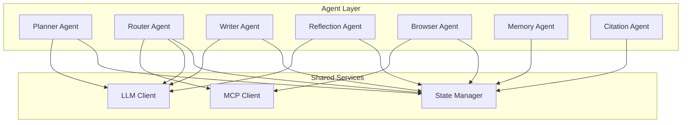
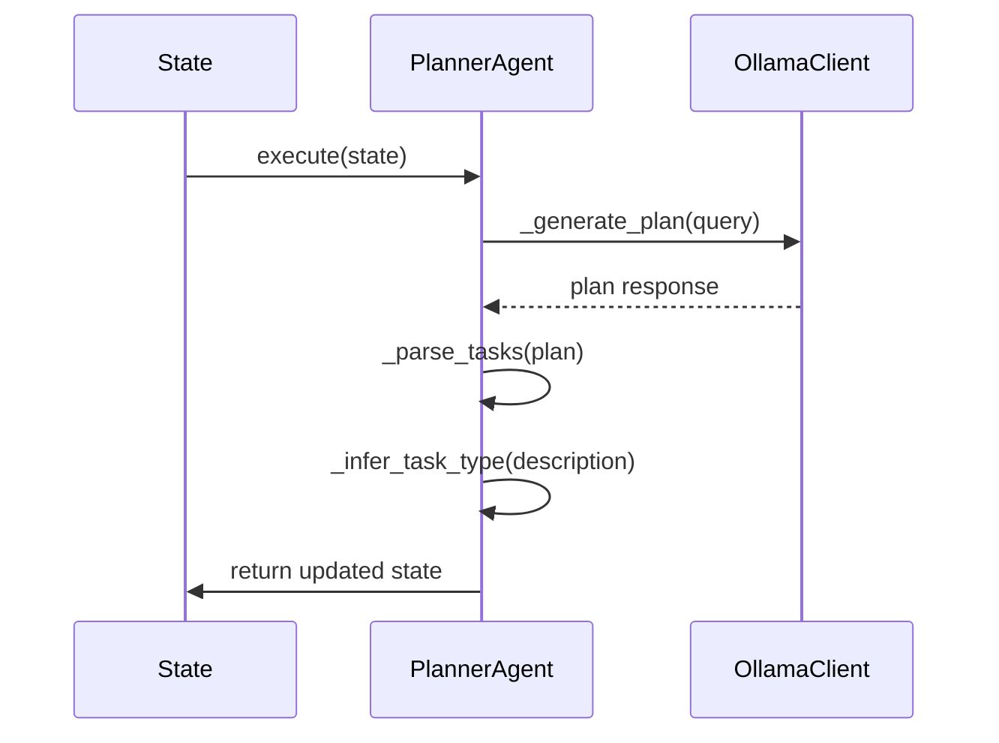
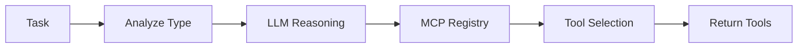
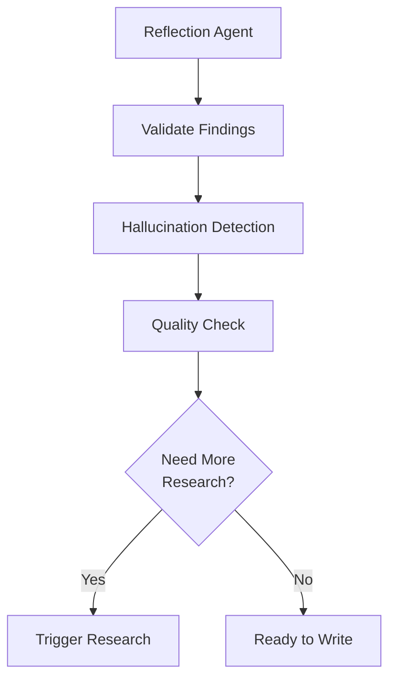
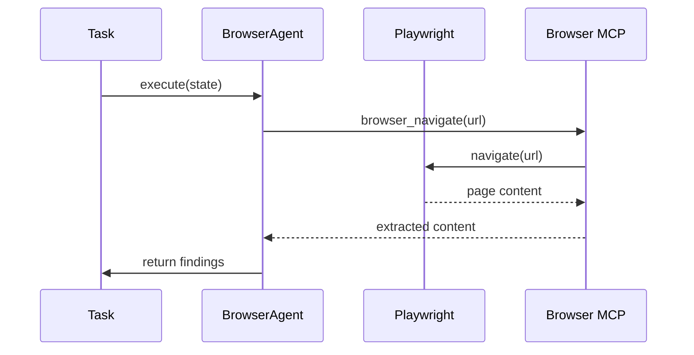
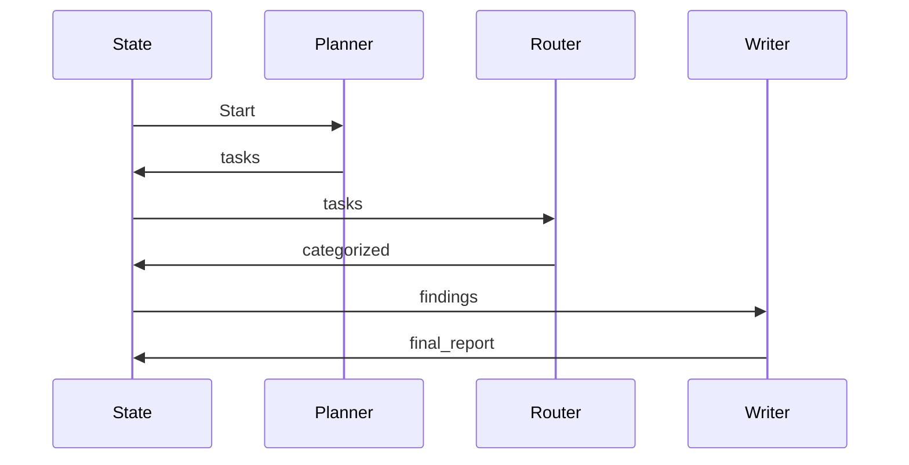
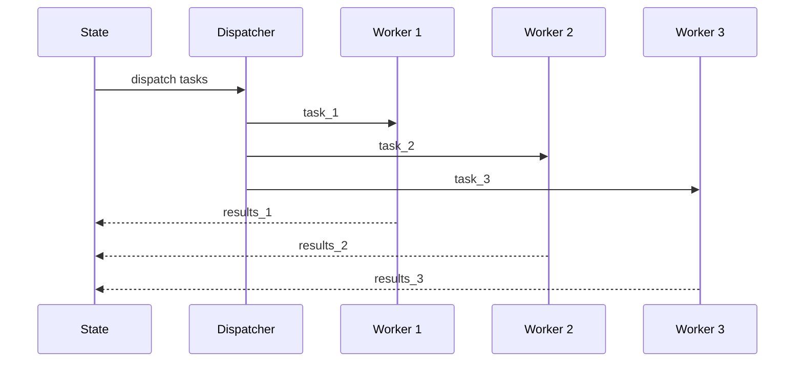
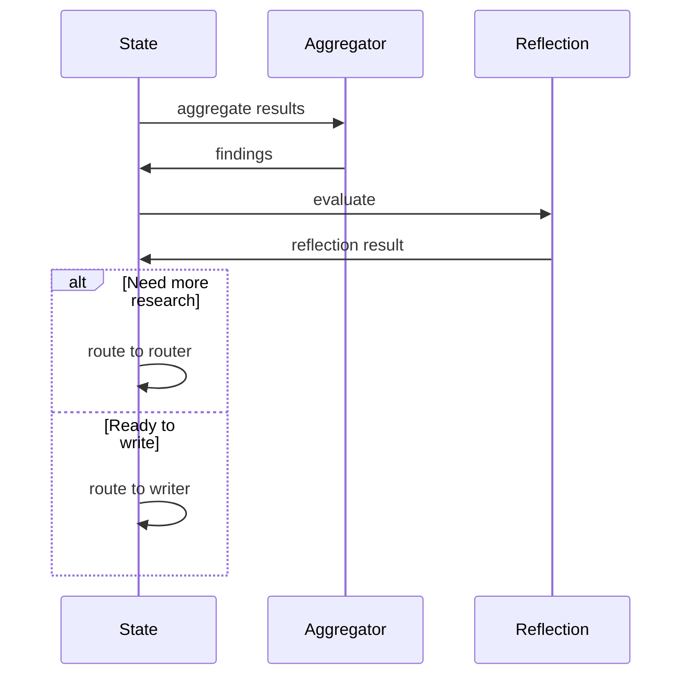

# Agent Architecture

## Purpose

This document provides comprehensive documentation of the multi-agent system architecture. It details each specialized agent's responsibilities, inputs, outputs, tools, workflows, and routing behavior. Understanding the agent architecture is essential for developers extending the platform or integrating new capabilities.

---

## 1. Agent Overview

The platform implements a specialized multi-agent architecture where each agent is responsible for a specific aspect of the research workflow:



---

## 2. Base Agent Class

All agents inherit from the BaseAgent class:

```python
class BaseAgent:
    def __init__(self, agent_name: str):
        self.agent_name = agent_name
        self.logger = logging.getLogger(f"agents.{agent_name}")

    async def execute(self, state: ResearchState) -> Dict[str, Any]:
        """Execute the agent's logic"""
        raise NotImplementedError
```

**Base Agent Features**:
- Standardized logging with session context
- Error handling and state management
- Consistent return format

---

## 3. Planner Agent

### Responsibilities

The Planner Agent is responsible for:
- **Query Decomposition**: Breaking complex research queries into manageable tasks
- **Planning**: Generating structured research plans
- **Prioritization**: Ordering tasks by importance
- **Strategy Generation**: Determining research approach

### Inputs

```python
{
    "session_id": "session_123",
    "query": "Research the latest developments in quantum computing",
    "max_reflections": 3
}
```

### Outputs

```python
{
    "tasks": [
        {
            "id": "task_1",
            "description": "Search for recent quantum computing breakthroughs",
            "type": "web_search",
            "status": "pending",
            "priority": 1
        },
        {
            "id": "task_2",
            "description": "Find quantum computing research papers",
            "type": "pdf_analysis",
            "status": "pending",
            "priority": 2
        }
    ],
    "next_action": "router",
    "status": "planned",
    "progress": 0.1
}
```

### Workflow



### Model

- **Primary Model**: qwen3 (Ollama)
- **Fallback**: GPT-4o

---

## 4. Router Agent

### Responsibilities

The Router Agent is responsible for:
- **Tool Determination**: Analyzing tasks to determine required tools
- **Task Routing**: Directing tasks to specialized execution paths
- **MCP Integration**: Managing MCP tool discovery and selection
- **Autonomous Selection**: Using LLM reasoning to select appropriate tools

### Inputs

```python
{
    "session_id": "session_123",
    "query": "Research quantum computing",
    "tasks": [
        {"id": "task_1", "description": "...", "type": "web_search"}
    ]
}
```

### Outputs

```python
{
    "tasks": [
        {
            "id": "task_1",
            "description": "...",
            "type": "web_search",
            "execution": {
                "method": "celery",
                "queue": "research",
                "agent": "web_research",
                "timeout": 60
            },
            "selected_tools": [
                {"name": "browser_navigate", "server": "browser"},
                {"name": "browser_evaluate", "server": "browser"}
            ]
        }
    ],
    "active_tasks": ["task_1"],
    "next_action": "aggregator",
    "status": "routed"
}
```

### Tool Selection



### Fallback Tool Mapping

| Task Type | Fallback Tools |
|-----------|----------------|
| web_search | browser_navigate, browser_evaluate |
| github_analysis | github_search_repos, github_get_file |
| browser | browser_navigate, browser_screenshot |
| pdf_analysis | filesystem_read |
| terminal | terminal_execute |

---

## 5. Reflection Agent

### Responsibilities

The Reflection Agent is responsible for:
- **Hallucination Detection**: Identifying potentially false information
- **Output Validation**: Verifying findings against sources
- **Quality Improvement**: Suggesting improvements to reports
- **Research Triggering**: Determining when additional research is needed

### Inputs

```python
{
    "session_id": "session_123",
    "findings": [
        {"summary": "...", "source": "..."}
    ],
    "reflection_count": 0,
    "max_reflections": 3
}
```

### Outputs

```python
{
    "reflections": [
        "Finding 1 is well-sourced",
        "Finding 2 needs verification"
    ],
    "reflection_count": 1,
    "next_action": "router",
    "status": "reflected"
}
```

### Reflection Logic



---

## 6. Writer Agent

### Responsibilities

The Writer Agent is responsible for:
- **Finding Aggregation**: Combining all research findings
- **Report Generation**: Creating structured, readable reports
- **Readability Improvement**: Enhancing document flow and clarity
- **Formatting**: Applying consistent formatting and structure

### Inputs

```python
{
    "session_id": "session_123",
    "findings": [...],
    "sources": [...],
    "query": "Research quantum computing"
}
```

### Outputs

```python
{
    "final_report": "# Quantum Computing Research\n\n## Summary\n...\n## Findings\n...\n## Sources\n...",
    "status": "completed",
    "metadata": {
        "writer_completed": true,
        "word_count": 1500
    }
}
```

---

## 7. Browser Agent

### Responsibilities

The Browser Agent is responsible for:
- **Website Navigation**: Visiting URLs and navigating web pages
- **Content Extraction**: Extracting dynamic content from JavaScript-heavy sites
- **Form Interaction**: Filling forms and submitting data
- **Screenshot Capture**: Taking visual snapshots of pages

### Tools

- Playwright for browser automation
- Browser MCP server for tool execution

### Execution Flow



---

## 8. Memory Agent

### Responsibilities

The Memory Agent is responsible for:
- **Memory Storage**: Persisting research context to vector store
- **Context Compression**: Summarizing long contexts for efficiency
- **Semantic Retrieval**: Finding relevant historical context
- **Session Management**: Maintaining session-level memory

### Storage

- **Redis**: Cache, queues, active sessions
- **PostgreSQL**: Sessions, reports, tasks, user history
- **ChromaDB**: Embeddings, semantic memory

### Memory Types

| Type | Storage | Purpose |
|------|---------|---------|
| Short-term | Graph State | Temporary reasoning |
| Episodic | PostgreSQL | Session history |
| Semantic | ChromaDB | Embeddings, search |
| Working | Redis | Active context |

---

## 9. Citation Agent

### Responsibilities

The Citation Agent is responsible for:
- **Source Tracking**: Maintaining list of all sources
- **Reference Generation**: Creating formatted citations
- **Citation Validation**: Verifying citation accuracy
- **Bibliography Creation**: Generating complete bibliography

### Citation Formats

- APA
- MLA
- Chicago
- IEEE

---

## 10. Agent Interaction Patterns

### Sequential Execution



### Parallel Execution



### Reflection Loop



---

## 11. Error Handling

Each agent implements consistent error handling:

```python
try:
    result = await self.execute(state)
    return result
except Exception as e:
    logger.error(f"[{session_id}] {agent_name} failed: {e}")
    return {
        "error_state": {
            "error": str(e),
            "stage": self.agent_name,
        },
        "status": "failed",
    }
```

---

## Related Documentation

- [System Overview](../architecture/system-overview.md)
- [LangGraph Workflows](../workflows/langgraph-workflows.md)
- [MCP Architecture](../mcp/mcp-architecture.md)