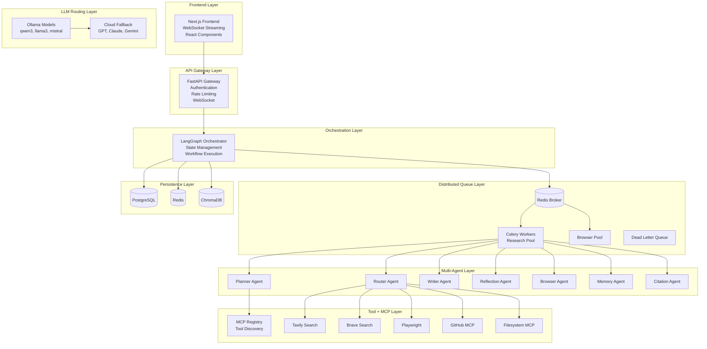
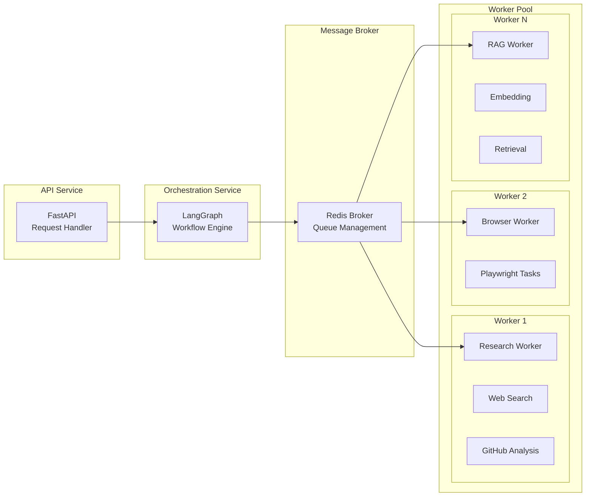
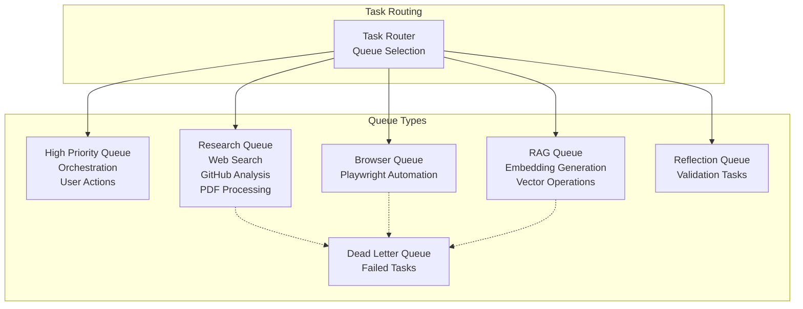
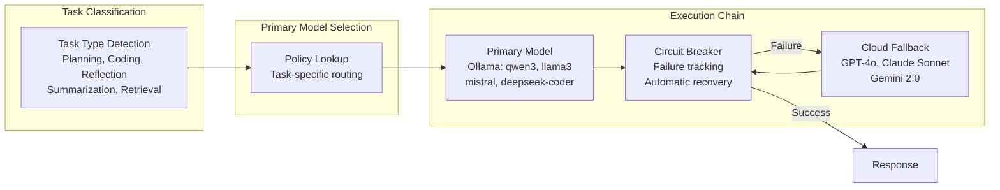
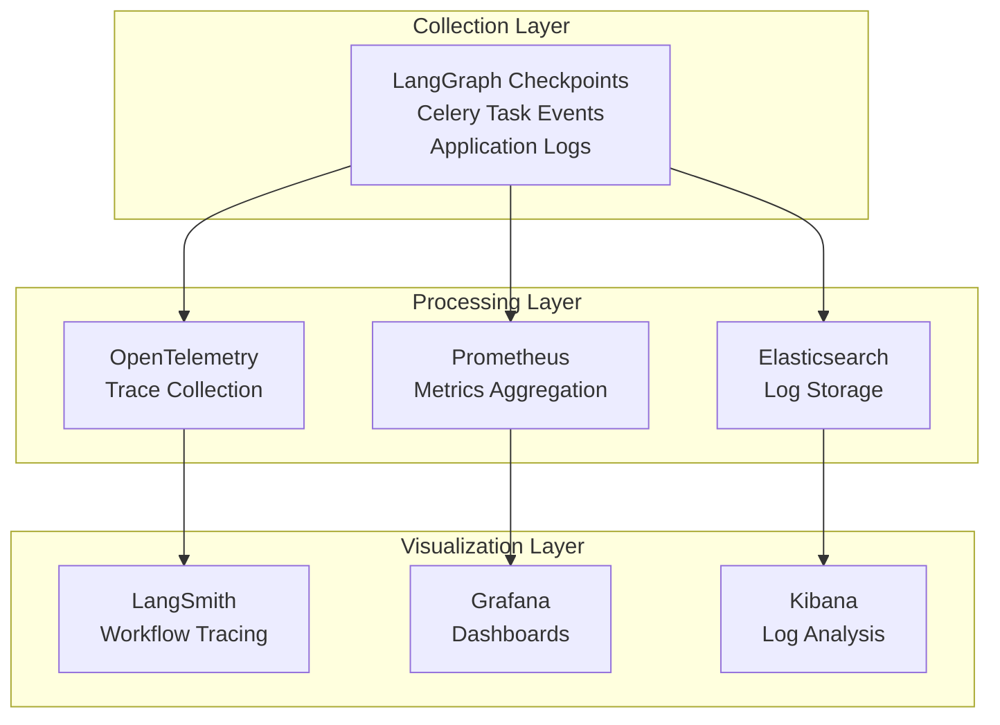

# System Overview

## Purpose

This document provides a comprehensive architectural overview of the AI Research Agent platform. It describes the high-level system architecture, distributed execution model, frontend/backend interaction patterns, queue architecture, model routing, and observability stack. This documentation serves as the primary reference for engineering teams, investors, and stakeholders seeking to understand the platform's technical foundations.

---

## 1. Platform Vision and Objectives

The AI Research Agent platform is a production-grade autonomous research system capable of:

- **Autonomous Planning**: Decomposing complex research queries into actionable task plans
- **Multi-Source Research**: Conducting web searches, GitHub repository analysis, PDF/document analysis, and browser automation
- **Long-Term Memory**: Persisting semantic memory across sessions using vector stores
- **Reflection and Self-Correction**: Validating findings and triggering additional research when needed
- **Report Generation**: Producing production-quality research reports with proper citations
- **Human-in-the-Loop Workflows**: Supporting approval checkpoints for critical actions
- **Multi-Model Orchestration**: Routing tasks to appropriate local or cloud LLM models
- **Local AI Execution**: Running models locally using Ollama with cloud fallback
- **MCP-Based Tool Ecosystem**: Integrating with external tools via the Model Context Protocol
- **Distributed Execution**: Scaling horizontally using Celery workers and Redis queues
- **Fault-Tolerant Orchestration**: Handling worker crashes, retries, and dead-letter queues

---

## 2. High-Level Architecture

The platform follows a layered architecture pattern with clear separation of concerns:

### Architecture Layers

| Layer | Components | Responsibilities |
|-------|------------|-------------------|
| Frontend | Next.js, React, WebSocket | User interface, real-time updates |
| API Gateway | FastAPI, Uvicorn | Authentication, rate limiting, request validation |
| Orchestration | LangGraph | Stateful workflow execution, node routing |
| Distributed Queue | Celery, Redis | Task distribution, worker management |
| Multi-Agent | Planner, Router, Writer, etc. | Specialized task execution |
| Tool + MCP | MCP Registry, External Tools | Tool discovery and execution |
| LLM Routing | Ollama, Cloud Providers | Model selection and fallback |
| Persistence | PostgreSQL, Redis, ChromaDB | Data storage and retrieval |

---

## 3. Distributed Execution Architecture

The platform employs a distributed execution model that separates orchestration from task execution:

### Execution Flow

1. **Request Reception**: Frontend sends request via WebSocket or REST API
2. **Workflow Creation**: LangGraph creates a new workflow instance with unique session ID
3. **Task Planning**: Planner Agent decomposes the query into tasks
4. **Task Routing**: Router Agent categorizes tasks and selects appropriate tools
5. **Task Dispatch**: Tasks are dispatched to Celery queues based on task type
6. **Parallel Execution**: Workers execute tasks in parallel across the cluster
7. **Result Aggregation**: Aggregator node collects results from all workers
8. **Reflection Loop**: Reflection Agent evaluates findings and may trigger additional research
9. **Report Generation**: Writer Agent produces the final report with citations

---

## 4. Queue Architecture

The platform uses a multi-queue architecture to prioritize and route tasks appropriately:

### Queue Configuration

| Queue | Priority | Max Retries | Time Limit | Use Case |
|-------|----------|-------------|------------|----------|
| high_priority | 0 (highest) | 5 | 5 min | Critical orchestration tasks |
| research | 5 | 3 | 10 min | Web search, GitHub, PDF |
| browser | 5 | 2 | 15 min | Playwright automation |
| rag | 10 | 3 | 7.5 min | Embedding, retrieval |
| reflection | 10 | 2 | 5 min | Validation tasks |
| dead_letter | 15 (lowest) | 0 | 1 min | Failed task debugging |

---

## 5. Model Routing Architecture

The platform implements intelligent model routing with automatic fallback:

### Default Routing Policies

| Task Type | Primary Model | Fallback Chain | Max Latency |
|-----------|---------------|----------------|-------------|
| Planning | qwen3 (Ollama) | GPT-4o, Claude Sonnet | 30s |
| Coding | deepseek-coder (Ollama) | Claude Sonnet, GPT-4o | 45s |
| Reflection | mistral (Ollama) | Gemini Flash, GPT-4o-mini | 20s |
| Summarization | llama3 (Ollama) | GPT-4o-mini, Claude Sonnet | 15s |
| Retrieval | qwen3 (Ollama) | GPT-4o-mini | 10s |
| Embedding | nomic-embed-text (Ollama) | text-embedding-3-small | 10s |

---

## 6. Observability Stack

The platform provides comprehensive observability through multiple integrated systems:

### Observability Components

| Component | Purpose | Metrics Traced |
|-----------|---------|----------------|
| LangSmith | Workflow tracing | Node execution, state transitions |
| Prometheus | Metrics collection | Latency, token usage, queue depth |
| Grafana | Visualization | Dashboards, alerts |
| OpenTelemetry | Distributed tracing | Request spans, dependencies |

---

## 7. Technology Stack Summary

| Layer | Technology | Version |
|-------|------------|---------|
| Frontend | Next.js, React, TailwindCSS | Next.js 14+ |
| API | FastAPI, Uvicorn | FastAPI 0.100+ |
| Orchestration | LangGraph | Latest |
| Queue | Celery, Redis | Celery 5.3+ |
| Database | PostgreSQL, Redis, ChromaDB | Latest |
| LLM | Ollama, OpenAI, Anthropic, Google | Latest |
| MCP | Custom MCP Implementation | Latest |
| Container | Docker, Kubernetes | Latest |

---

## 8. Key Architectural Principles

1. **Local-First**: Prefer local Ollama models for cost efficiency and privacy
2. **Fault-Tolerant**: Automatic fallback chains and circuit breakers
3. **Distributed**: Horizontal scaling via Celery workers
4. **Observable**: Comprehensive tracing and metrics at every layer
5. **Secure**: Browser isolation, RBAC, tenant isolation
6. **Modular**: Clean separation between agents, tools, and infrastructure

---

## Related Documentation

- [LangGraph Workflows](../workflows/langgraph-workflows.md)
- [Agent Architecture](../agents/agents.md)
- [Distributed Execution](../backend/distributed-execution.md)
- [Model Routing](../backend/model-routing.md)
- [Observability](../observability/observability.md)