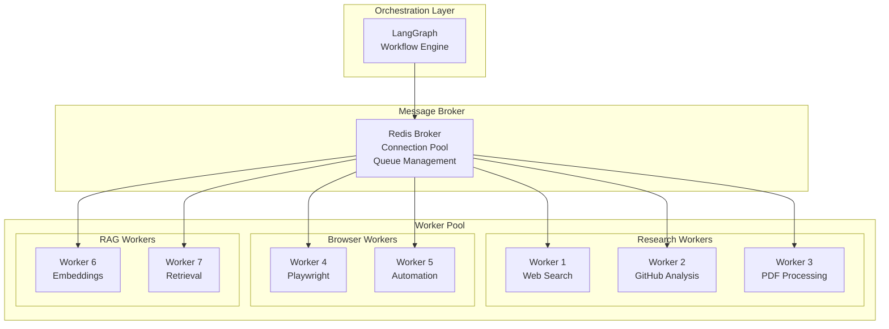
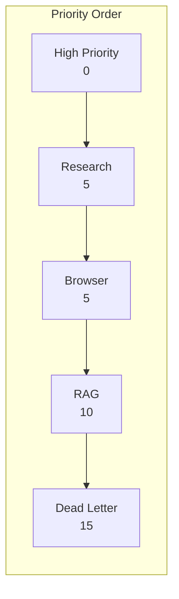
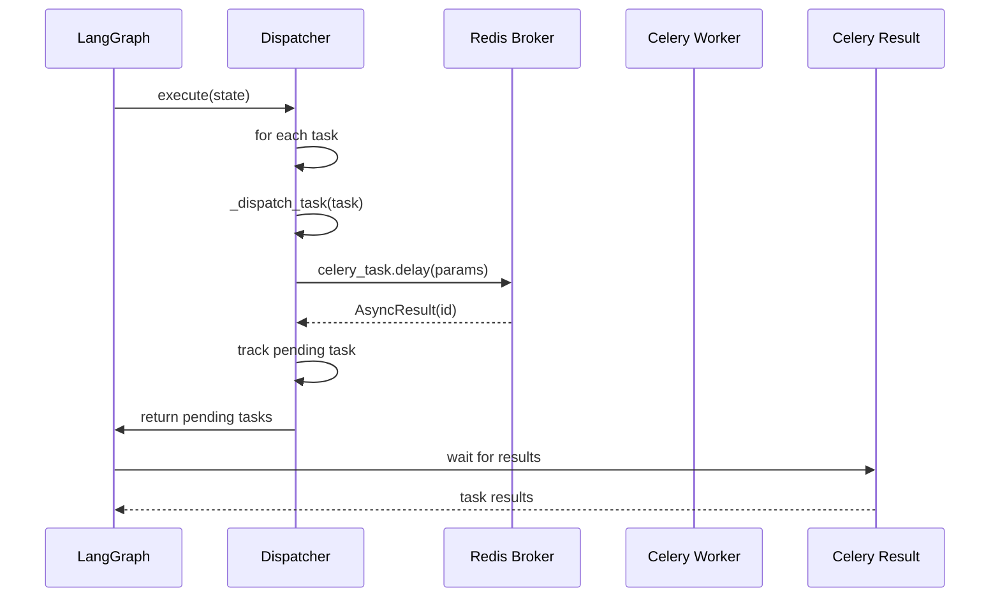
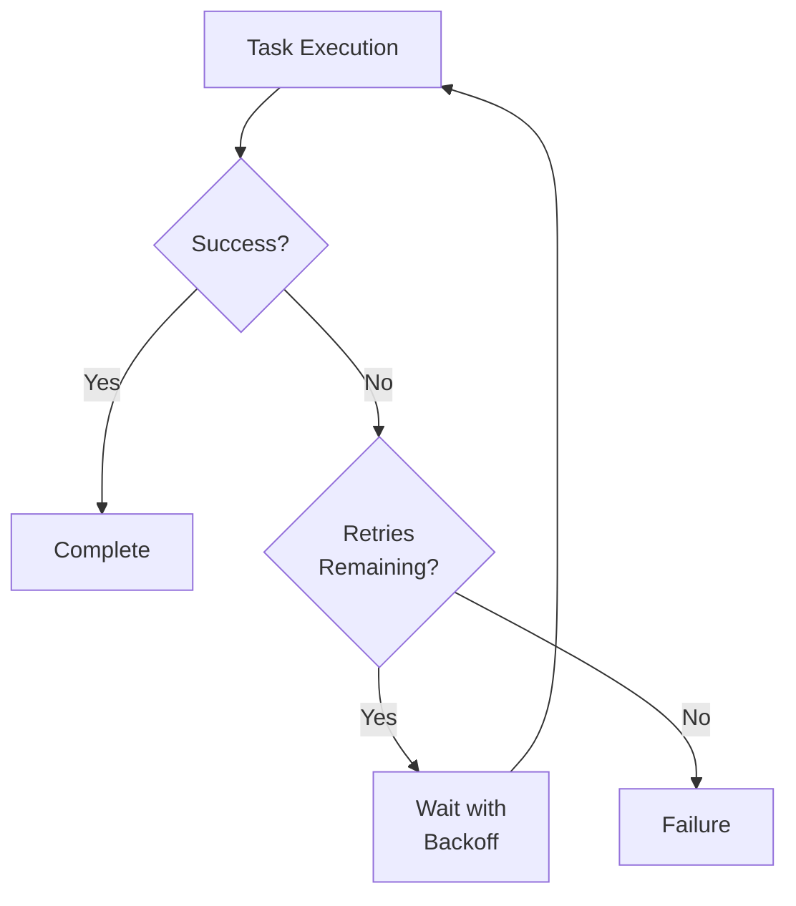
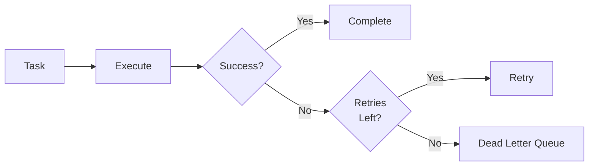
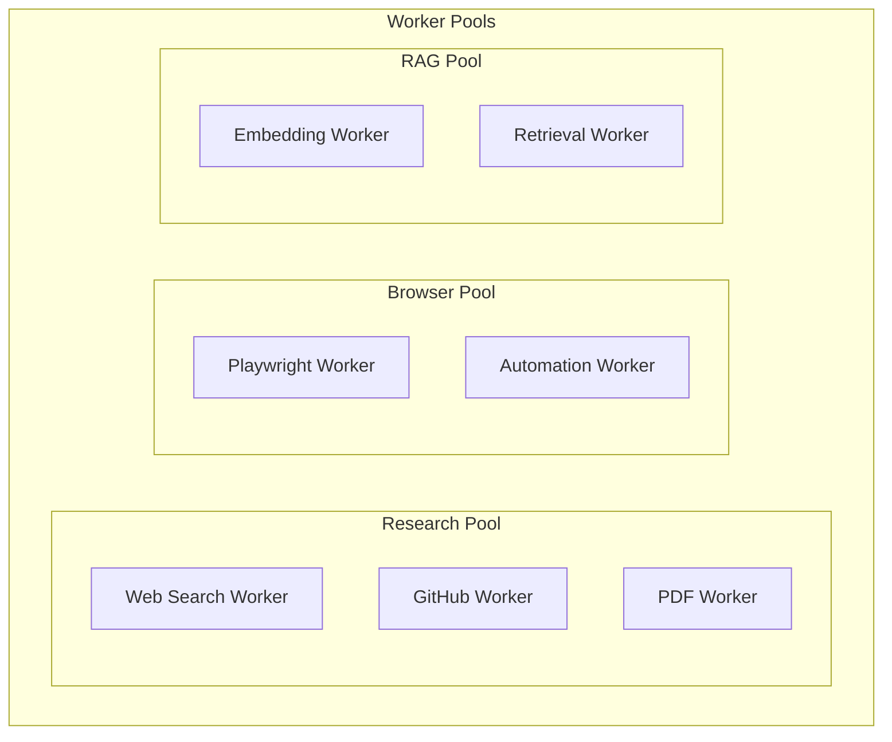
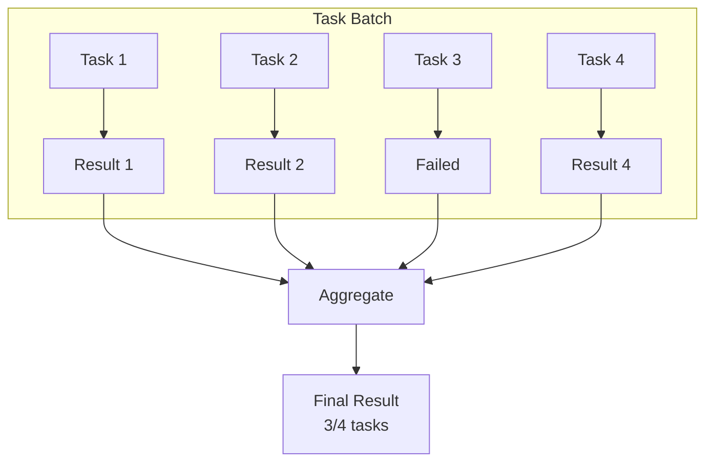

# Distributed Execution Architecture

## Purpose

This document provides comprehensive documentation of the Celery-based distributed execution system. It explains worker pools, queue routing, retry mechanisms, dead-letter queues, and task orchestration patterns. This documentation is essential for understanding how the platform achieves horizontal scalability and fault tolerance.

---

## 1. Architecture Overview

The distributed execution system separates the orchestration layer (LangGraph) from the task execution layer (Celery workers):



---

## 2. Celery Configuration

### Core Configuration

```python
celery_app.conf.update(
    # Task execution (CRITICAL for reliability)
    task_acks_late=True,  # Acknowledge after task completes
    worker_prefetch_multiplier=1,  # Prefetch 1 task per worker
    task_track_started=True,  # Track when task starts
    task_time_limit=600,  # 10 minutes hard limit
    task_soft_time_limit=300,  # 5 minutes soft limit

    # Serialization
    task_serializer="json",
    result_serializer="json",
    accept_content=["json"],

    # Broker connection with retry
    broker_connection_retry_on_startup=True,  # CRITICAL
    broker_connection_retry=True,
    broker_connection_max_retries=10,
    broker_pool_limit=10,
    broker_heartbeat=60,

    # Result backend
    result_expires=3600,  # 1 hour expiry
    result_persistent=True,
    result_extended=True,

    # Worker settings
    worker_max_tasks_per_child=100,
    worker_disable_rate_limits=True,
    worker_send_task_events=True,
    worker_pool="prefork",
    worker_concurrency=2,
)
```

### Configuration Rationale

| Setting | Value | Rationale |
|---------|-------|-----------|
| task_acks_late | True | Prevents task loss on worker crash |
| worker_prefetch_multiplier | 1 | Ensures fair distribution |
| task_time_limit | 600s | Prevents runaway tasks |
| broker_connection_retry_on_startup | True | Ensures broker availability |

---

## 3. Queue Architecture

### Queue Definitions

```python
QUEUES = {
    "high_priority": {
        "priority": 0,
        "max_retries": 5,
        "default_retry_delay": 10,
        "time_limit": 300,
        "description": "Critical orchestration and user-facing tasks"
    },
    "research": {
        "priority": 5,
        "max_retries": 3,
        "default_retry_delay": 30,
        "time_limit": 600,
        "description": "Research tasks: web search, GitHub, PDF analysis"
    },
    "browser": {
        "priority": 5,
        "max_retries": 2,
        "default_retry_delay": 60,
        "time_limit": 900,
        "description": "Browser automation and web scraping tasks"
    },
    "rag": {
        "priority": 10,
        "max_retries": 3,
        "default_retry_delay": 45,
        "time_limit": 450,
        "description": "RAG tasks: chunking, embedding, retrieval"
    },
    "reflection": {
        "priority": 10,
        "max_retries": 2,
        "default_retry_delay": 60,
        "time_limit": 300,
        "description": "Reflection and validation tasks"
    },
    "dead_letter": {
        "priority": 15,
        "max_retries": 0,
        "time_limit": 60,
        "description": "Failed tasks for debugging and recovery"
    }
}
```

### Queue Priority Flow



---

## 4. Task Routing

### Task Route Configuration

```python
task_routes = {
    "workers.tasks.research.*": {"queue": "research"},
    "workers.tasks.browser.*": {"queue": "browser"},
    "workers.tasks.rag.*": {"queue": "rag"},
    "workers.tasks.reflection.*": {"queue": "reflection"},
}
```

### Task Mapping

| Task Type | Celery Task | Queue | Timeout |
|-----------|-------------|-------|---------|
| web_search | workers.tasks.research.web_search | research | 60s |
| github_analysis | workers.tasks.research.github_analysis | research | 120s |
| pdf_analysis | workers.tasks.research.pdf_analysis | research | 180s |
| browser | workers.tasks.browser.browser_navigate | browser | 300s |
| rag | workers.tasks.rag.semantic_retrieval | rag | 60s |

---

## 5. Task Dispatch Flow



---

## 6. Retry Mechanism

### Retry Configuration

```python
@celery.task(
    bind=True,
    autoretry_for=(Exception,),
    retry_backoff=True,
    retry_backoff_max=600,
    retry_kwargs={"max_retries": 3}
)
def web_search(self, query, session_id):
    # Task implementation
    pass
```

### Retry Flow



### Exponential Backoff

| Attempt | Delay |
|---------|-------|
| 1 | 1s |
| 2 | 2s |
| 3 | 4s |
| 4 | 8s |
| 5 | 16s |

---

## 7. Dead Letter Queue

### Dead Letter Handling

Tasks that exceed maximum retries are moved to the dead letter queue:



### Dead Letter Processing

```python
@celery.task(queue="dead_letter")
def process_dead_letter(task_id, error, traceback):
    """Process failed tasks for debugging"""
    logger.error(f"Dead letter: {task_id}")
    logger.error(f"Error: {error}")
    # Store for debugging
    # Alert on-call team
    pass
```

---

## 8. Worker Pools

### Worker Types



### Worker Scaling

| Worker Type | Scaling Strategy | Resource Needs |
|-------------|------------------|----------------|
| Research | Horizontal (CPU-bound) | 2-4 cores |
| Browser | Horizontal (memory-bound) | 4-8GB RAM |
| RAG | Horizontal (I/O-bound) | 2 cores |

---

## 9. Result Aggregation

### Aggregation Pattern

```python
async def _aggregator_node(self, state):
    pending_tasks = state.get("active_tasks", [])
    completed_findings = []
    failed_tasks = []

    timeout = 120  # seconds

    for correlation_id in pending_tasks:
        result = await self._wait_for_task(celery_id, timeout)

        if result.ready():
            if result.successful():
                completed_findings.extend(extract_findings(result))
            else:
                failed_tasks.append(...)

    # Deduplicate and return
    return {
        "findings": deduplicate(completed_findings),
        "failed_tasks": failed_tasks
    }
```

### Partial Failure Handling



---

## 10. Health Monitoring

### Worker Health Check

```python
def health_check():
    inspect = Inspect(celery_app)
    stats = inspect.stats()
    active = inspect.active()

    return {
        "status": "healthy" if stats else "no_workers",
        "workers": len(stats),
        "active_tasks": count_active_tasks(active)
    }
```

### Queue Statistics

```python
def get_queue_stats():
    inspect = Inspect(celery_app)
    stats = inspect.stats()

    return {
        "high_priority": {"tasks": 0, "workers": 0},
        "research": {"tasks": 0, "workers": 0},
        "browser": {"tasks": 0, "workers": 0},
        "rag": {"tasks": 0, "workers": 0}
    }
```

---

## 11. Signal Handlers

### Task Lifecycle Events

```python
@task_prerun.connect
def on_task_prerun(task_id, task, *args, **kwargs):
    logger.debug(f"Task {task_id} ({task.name}) starting")

@task_postrun.connect
def on_task_postrun(task_id, task, *args, **kwargs):
    logger.debug(f"Task {task_id} ({task.name}) completed")

@task_failure.connect
def on_task_failure(sender, task_id, exception, ...):
    logger.error(f"Task {task_id} failed: {exception}")

@task_retry.connect
def on_task_retry(sender, task, reason, ...):
    logger.warning(f"Task {sender} retrying: {reason}")
```

---

## Related Documentation

- [System Overview](../architecture/system-overview.md)
- [LangGraph Workflows](../workflows/langgraph-workflows.md)
- [Scaling Strategy](../scaling/scaling-strategy.md)