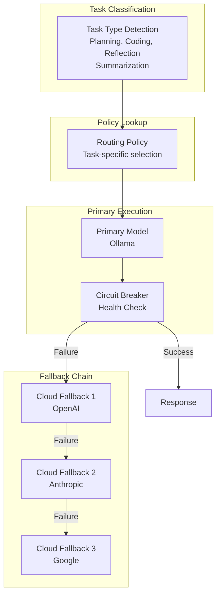
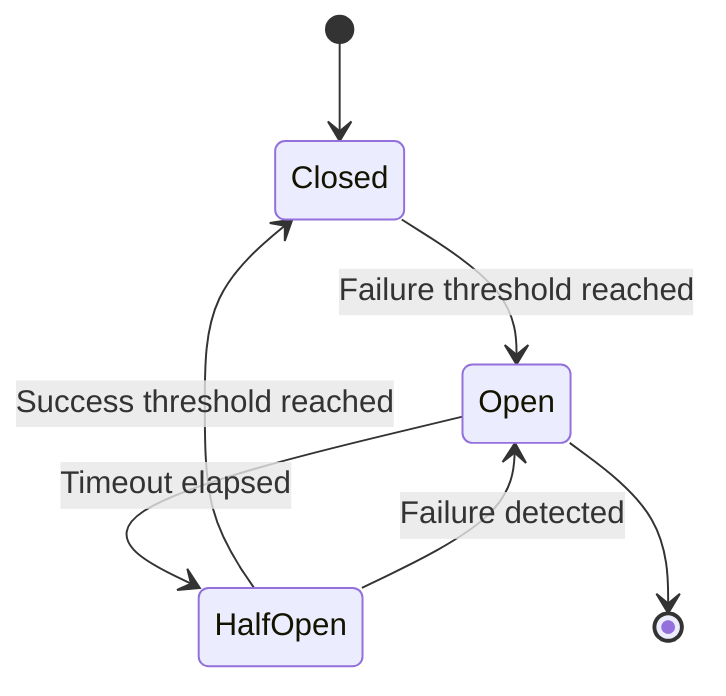
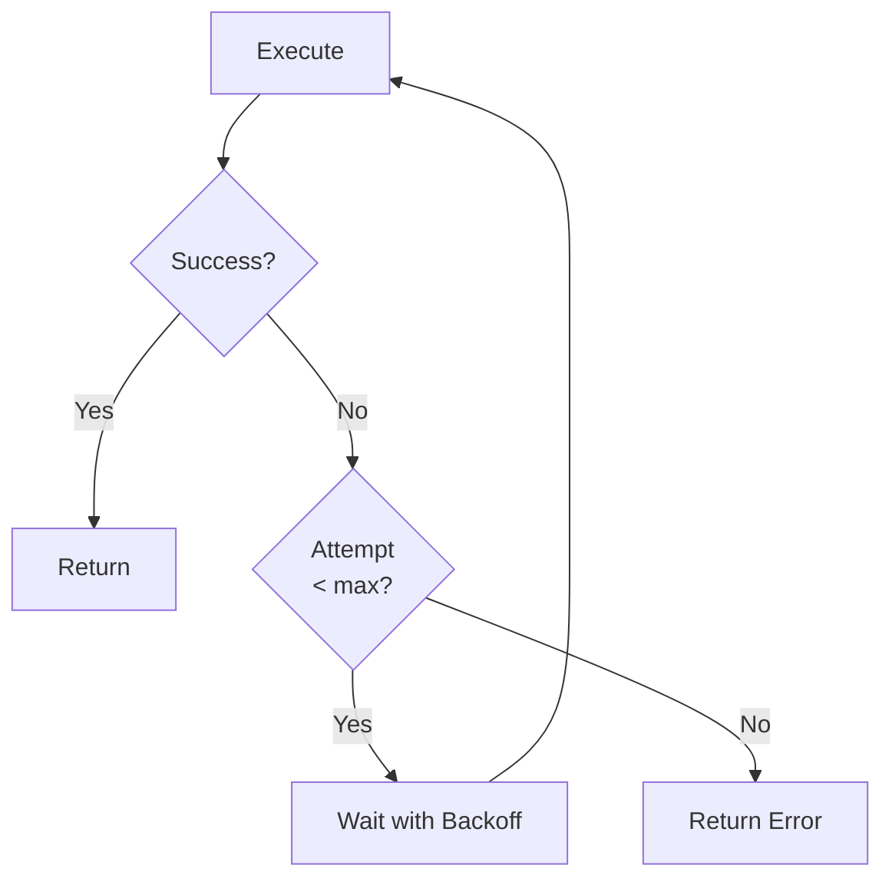
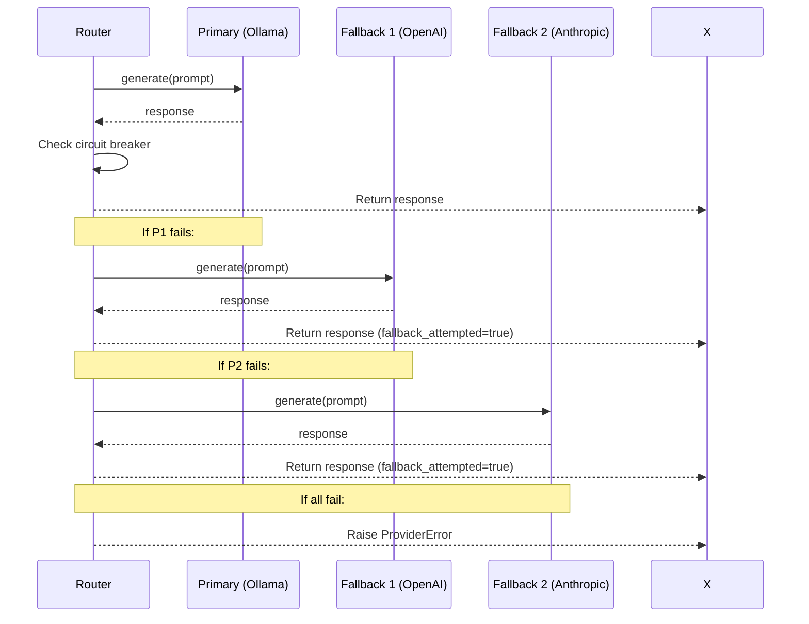

# Model Routing Documentation

## Purpose

This document provides comprehensive documentation of the hybrid model routing system. It explains Ollama routing, cloud fallback mechanisms, GPU-aware routing, cost optimization, and provider abstraction. This documentation is essential for understanding how the platform selects and manages LLM models.

---

## 1. Routing Architecture Overview

The platform implements intelligent model routing with automatic fallback:



---

## 2. Task Types

```python
class TaskType(Enum):
    PLANNING = "planning"
    CODING = "coding"
    REFLECTION = "reflection"
    SUMMARIZATION = "summarization"
    RETRIEVAL = "retrieval"
    GENERAL = "general"
    EMBEDDING = "embedding"
```

### Task Type Mapping

| Task Type | Description | Example Operations |
|-----------|-------------|---------------------|
| PLANNING | Research planning | Query decomposition, task creation |
| CODING | Code-related tasks | Code generation, debugging |
| REFLECTION | Validation | Hallucination detection, quality check |
| SUMMARIZATION | Summarization | Report writing, content summary |
| RETRIEVAL | Information retrieval | Context lookup, search |
| GENERAL | General tasks | Default routing |
| EMBEDDING | Embedding generation | Text vectorization |

---

## 3. Routing Policies

### Default Policies

```python
DEFAULT_ROUTING_POLICIES = {
    TaskType.PLANNING: RoutingPolicy(
        task_type=TaskType.PLANNING,
        primary_model="qwen3",
        primary_provider="ollama",
        fallback_chain=["openai:gpt-4o", "anthropic:claude-sonnet-4-20250514"],
        max_latency_ms=30000,
        max_cost=0.5,
    ),
    TaskType.CODING: RoutingPolicy(
        task_type=TaskType.CODING,
        primary_model="deepseek-coder",
        primary_provider="ollama",
        fallback_chain=["anthropic:claude-sonnet-4-20250514", "openai:gpt-4o"],
        max_latency_ms=45000,
        max_cost=1.0,
    ),
    TaskType.REFLECTION: RoutingPolicy(
        task_type=TaskType.REFLECTION,
        primary_model="mistral",
        primary_provider="ollama",
        fallback_chain=["google:gemini-2.0-flash", "openai:gpt-4o-mini"],
        max_latency_ms=20000,
        max_cost=0.3,
    ),
    TaskType.SUMMARIZATION: RoutingPolicy(
        task_type=TaskType.SUMMARIZATION,
        primary_model="llama3",
        primary_provider="ollama",
        fallback_chain=["openai:gpt-4o-mini", "anthropic:claude-3-5-sonnet-20240620"],
        max_latency_ms=15000,
        max_cost=0.2,
    ),
    TaskType.RETRIEVAL: RoutingPolicy(
        task_type=TaskType.RETRIEVAL,
        primary_model="qwen3",
        primary_provider="ollama",
        fallback_chain=["openai:gpt-4o-mini"],
        max_latency_ms=10000,
        max_cost=0.1,
    ),
    TaskType.GENERAL: RoutingPolicy(
        task_type=TaskType.GENERAL,
        primary_model="qwen3",
        primary_provider="ollama",
        fallback_chain=["openai:gpt-4o", "anthropic:claude-sonnet-4-20250514"],
        max_latency_ms=30000,
        max_cost=0.5,
    ),
    TaskType.EMBEDDING: RoutingPolicy(
        task_type=TaskType.EMBEDDING,
        primary_model="nomic-embed-text",
        primary_provider="ollama",
        fallback_chain=["openai:text-embedding-3-small"],
        max_latency_ms=10000,
        max_cost=0.05,
    ),
}
```

---

## 4. Circuit Breaker

### Circuit Breaker States



### Circuit Breaker Implementation

```python
@dataclass
class CircuitBreakerState:
    provider_name: str
    state: str = "closed"  # closed, open, half_open
    failure_count: int = 0
    success_count: int = 0
    last_failure_time: Optional[datetime] = None

    failure_threshold: int = 5
    success_threshold: int = 2
    timeout_seconds: int = 60

    def record_success(self):
        self.success_count += 1
        if self.state == "half_open" and self.success_count >= self.success_threshold:
            self.state = "closed"
            self.failure_count = 0

    def record_failure(self):
        self.failure_count += 1
        if self.state == "closed" and self.failure_count >= self.failure_threshold:
            self.state = "open"

    def can_attempt(self) -> bool:
        if self.state == "closed":
            return True
        if self.state == "open":
            if self.last_failure_time:
                time_since_failure = (datetime.utcnow() - self.last_failure_time).total_seconds()
                if time_since_failure >= self.timeout_seconds:
                    self.state = "half_open"
                    return True
            return False
        return True  # half_open
```

---

## 5. Retry Policy

### Retry Configuration

```python
@dataclass
class RetryPolicy:
    max_retries: int = 3
    base_delay: float = 1.0
    max_delay: float = 60.0
    exponential_base: float = 2.0
    jitter: bool = True

    def get_delay(self, attempt: int) -> float:
        delay = self.base_delay * (self.exponential_base ** (attempt - 1))
        delay = min(delay, self.max_delay)
        if self.jitter:
            delay *= random.uniform(0.5, 1.5)
        return delay

    def should_retry(self, attempt: int, error: Exception) -> bool:
        if attempt >= self.max_retries:
            return False
        non_retryable = (ProviderAuthenticationError, ProviderModelUnavailableError)
        return not isinstance(error, non_retryable)
```

### Retry Flow



---

## 6. Model Router

### Router Interface

```python
class ModelRouter:
    def __init__(self):
        self._providers: Dict[str, LLMProvider] = {}
        self._circuit_breakers: Dict[str, CircuitBreakerState] = {}
        self._routing_policies = DEFAULT_ROUTING_POLICIES.copy()

    def register_provider(self, provider: LLMProvider):
        """Register a provider"""
        self._providers[provider.name] = provider
        self._circuit_breakers[provider.name] = CircuitBreakerState(
            provider_name=provider.name
        )

    async def route(
        self,
        task_type: TaskType,
        prompt: str,
        system: Optional[str] = None,
        temperature: float = 0.7,
        max_tokens: Optional[int] = None
    ) -> tuple[LLMResponse, RoutingDecision]:
        """Route request with fallback"""
        policy = self.get_policy(task_type)

        # Try primary
        try:
            return await self._try_provider(
                f"{policy.primary_provider}:{policy.primary_model}",
                prompt, system, temperature, max_tokens, task_type, policy
            )
        except Exception as primary_error:
            # Try fallback chain
            for fallback in policy.fallback_chain:
                try:
                    response, decision = await self._try_provider(
                        fallback, prompt, system, temperature, max_tokens,
                        task_type, policy
                    )
                    decision.fallback_attempted = True
                    return response, decision
                except:
                    continue

        raise ProviderError(f"All providers failed")
```

---

## 7. Provider Abstraction

### Provider Interface

```python
class LLMProvider(ABC):
    @abstractmethod
    async def generate(
        self,
        prompt: str,
        system: Optional[str] = None,
        temperature: float = 0.7,
        max_tokens: Optional[int] = None
    ) -> LLMResponse:
        pass

    @abstractmethod
    async def chat(
        self,
        messages: List[Dict[str, str]],
        temperature: float = 0.7,
        max_tokens: Optional[int] = None
    ) -> LLMResponse:
        pass

    @abstractmethod
    async def embeddings(self, texts: List[str]) -> List[Embedding]:
        pass
```

### Provider Types

| Provider | Type | Models |
|----------|------|--------|
| OllamaProvider | Local | qwen3, llama3, mistral, deepseek-coder |
| OpenAIProvider | Cloud | GPT-4o, GPT-4o-mini |
| AnthropicProvider | Cloud | Claude Sonnet, Claude Haiku |
| GoogleProvider | Cloud | Gemini Pro, Gemini Flash |

---

## 8. Fallback Chain Execution

### Execution Flow



---

## 9. Routing Statistics

### Statistics Tracking

```python
def get_routing_stats(self) -> Dict[str, Dict[str, Any]]:
    """Get routing statistics"""
    return {
        provider: {
            "total_requests": stats["total_requests"],
            "successful_requests": stats["successful_requests"],
            "failed_requests": stats["failed_requests"],
            "fallback_count": stats["fallback_count"],
            "avg_latency_ms": stats["total_latency_ms"] / max(stats["total_requests"], 1)
        }
        for provider, stats in self._routing_stats.items()
    }
```

### Circuit Breaker Status

```python
def get_circuit_breaker_status(self) -> Dict[str, Dict[str, Any]]:
    """Get circuit breaker status"""
    return {
        name: {
            "state": cb.state,
            "failure_count": cb.failure_count,
            "success_count": cb.success_count,
            "last_failure_time": cb.last_failure_time.isoformat() if cb.last_failure_time else None
        }
        for name, cb in self._circuit_breakers.items()
    }
```

---

## 10. Cost Optimization

### Cost-Aware Routing

```python
def select_model_by_cost(self, task_type: TaskType, budget: float) -> str:
    """Select model within budget"""
    policy = self.get_policy(task_type)

    if policy.max_cost <= budget:
        return policy.primary_model

    # Find fallback within budget
    for fallback in policy.fallback_chain:
        # Check cost (implementation depends on provider)
        if self._get_model_cost(fallback) <= budget:
            return fallback

    return policy.primary_model  # Default to primary
```

---

## Related Documentation

- [System Overview](../architecture/system-overview.md)
- [Distributed Execution](../backend/distributed-execution.md)
- [Observability](../observability/observability.md)