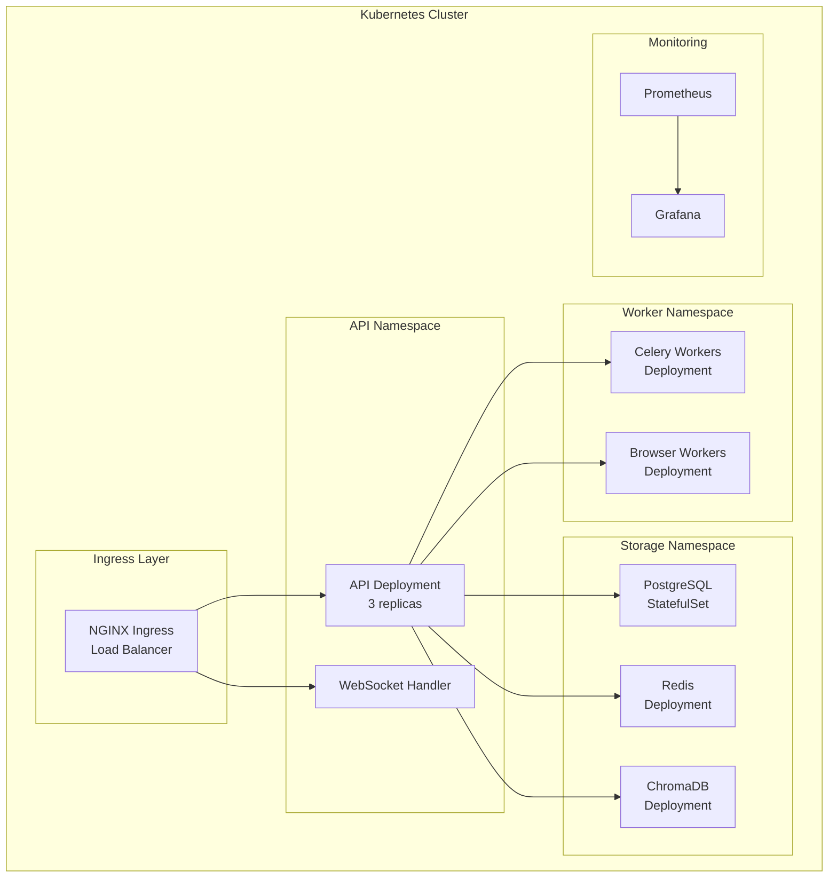

# Kubernetes Deployment Documentation

## Purpose

This document provides comprehensive documentation of the Kubernetes deployment architecture. It explains Helm charts, autoscaling, deployments, ingress, networking, and service mesh integration. This documentation is essential for DevOps engineers and platform operators managing production deployments.

---

## 1. Kubernetes Architecture Overview

The platform deploys as a complete Kubernetes application:



---

## 2. Helm Chart Structure

```
research-agent/
├── Chart.yaml
├── values.yaml
├── values-prod.yaml
├── values-staging.yaml
├── templates/
│   ├── api/
│   │   ├── deployment.yaml
│   │   ├── service.yaml
│   │   ├── hpa.yaml
│   │   └── configmap.yaml
│   ├── workers/
│   │   ├── celery-worker.yaml
│   │   ├── browser-worker.yaml
│   │   └── configmap.yaml
│   ├── storage/
│   │   ├── postgres.yaml
│   │   ├── redis.yaml
│   │   └── chromadb.yaml
│   ├── ingress/
│   │   └── ingress.yaml
│   └── monitoring/
│       ├── prometheus.yaml
│       └── grafana.yaml
└── charts/
```

---

## 3. API Deployment

### Deployment Manifest

```yaml
apiVersion: apps/v1
kind: Deployment
metadata:
  name: research-api
  namespace: research-agent
spec:
  replicas: 3
  selector:
    matchLabels:
      app: research-api
  template:
    metadata:
      labels:
        app: research-api
    spec:
      containers:
      - name: api
        image: research-agent/api:latest
        ports:
        - containerPort: 8000
        env:
        - name: DATABASE_URL
          valueFrom:
            secretKeyRef:
              name: research-secrets
              key: database-url
        - name: REDIS_URL
          valueFrom:
            secretKeyRef:
              name: research-secrets
              key: redis-url
        resources:
          requests:
            cpu: 500m
            memory: 1Gi
          limits:
            cpu: 2000m
            memory: 4Gi
        livenessProbe:
          httpGet:
            path: /api/v1/health
            port: 8000
          initialDelaySeconds: 30
          periodSeconds: 10
        readinessProbe:
          httpGet:
            path: /api/v1/health
            port: 8000
          initialDelaySeconds: 10
          periodSeconds: 5
```

### Horizontal Pod Autoscaler

```yaml
apiVersion: autoscaling/v2
kind: HorizontalPodAutoscaler
metadata:
  name: research-api-hpa
  namespace: research-agent
spec:
  scaleTargetRef:
    apiVersion: apps/v1
    kind: Deployment
    name: research-api
  minReplicas: 3
  maxReplicas: 20
  metrics:
  - type: Resource
    resource:
      name: cpu
      target:
        type: Utilization
        averageUtilization: 70
  - type: Resource
    resource:
      name: memory
      target:
        type: Utilization
        averageUtilization: 80
  behavior:
    scaleUp:
      stabilizationWindowSeconds: 60
      policies:
      - type: Percent
        value: 100
        periodSeconds: 60
    scaleDown:
      stabilizationWindowSeconds: 300
```

---

## 4. Worker Deployments

### Celery Worker Deployment

```yaml
apiVersion: apps/v1
kind: Deployment
metadata:
  name: celery-research-worker
  namespace: research-agent
spec:
  replicas: 5
  selector:
    matchLabels:
      app: celery-worker
      worker-type: research
  template:
    metadata:
      labels:
        app: celery-worker
        worker-type: research
    spec:
      containers:
      - name: worker
        image: research-agent/worker:latest
        command: ["celery", "-A", "workers.celery_app", "worker", "-Q", "research", "-c", "4"]
        env:
        - name: BROKER_URL
          valueFrom:
            secretKeyRef:
              name: research-secrets
              key: broker-url
        resources:
          requests:
            cpu: 1000m
            memory: 2Gi
          limits:
            cpu: 4000m
            memory: 8Gi
```

### Browser Worker Deployment

```yaml
apiVersion: apps/v1
kind: Deployment
metadata:
  name: celery-browser-worker
  namespace: research-agent
spec:
  replicas: 3
  selector:
    matchLabels:
      app: celery-worker
      worker-type: browser
  template:
    metadata:
      labels:
        app: celery-worker
        worker-type: browser
    spec:
      containers:
      - name: worker
        image: research-agent/worker:latest
        command: ["celery", "-A", "workers.celery_app", "worker", "-Q", "browser", "-c", "2"]
        resources:
          requests:
            cpu: 2000m
            memory: 4Gi
          limits:
            cpu: 8000m
            memory: 16Gi
```

---

## 5. Storage Deployments

### PostgreSQL StatefulSet

```yaml
apiVersion: apps/v1
kind: StatefulSet
metadata:
  name: postgres
  namespace: research-agent
spec:
  serviceName: postgres
  replicas: 1
  selector:
    matchLabels:
      app: postgres
  template:
    metadata:
      labels:
        app: postgres
    spec:
      containers:
      - name: postgres
        image: postgres:15
        env:
        - name: POSTGRES_DB
          value: research_agent
        - name: POSTGRES_USER
          valueFrom:
            secretKeyRef:
              name: research-secrets
              key: postgres-user
        - name: POSTGRES_PASSWORD
          valueFrom:
            secretKeyRef:
              name: research-secrets
              key: postgres-password
        volumeMounts:
        - name: postgres-data
          mountPath: /var/lib/postgresql/data
        resources:
          requests:
            cpu: 500m
            memory: 1Gi
          limits:
            cpu: 2000m
            memory: 4Gi
  volumeClaimTemplates:
  - metadata:
      name: postgres-data
    spec:
      accessModes: ["ReadWriteOnce"]
      resources:
        requests:
          storage: 50Gi
```

### Redis Deployment

```yaml
apiVersion: apps/v1
kind: Deployment
metadata:
  name: redis
  namespace: research-agent
spec:
  replicas: 3
  selector:
    matchLabels:
      app: redis
  template:
    metadata:
      labels:
        app: redis
    spec:
      containers:
      - name: redis
        image: redis:7-alpine
        command: ["redis-server", "--appendonly", "yes"]
        volumeMounts:
        - name: redis-data
          mountPath: /data
        resources:
          requests:
            cpu: 250m
            memory: 512Mi
          limits:
            cpu: 1000m
            memory: 2Gi
```

---

## 6. Ingress Configuration

```yaml
apiVersion: networking.k8s.io/v1
kind: Ingress
metadata:
  name: research-agent-ingress
  namespace: research-agent
  annotations:
    nginx.ingress.kubernetes.io/proxy-body-size: "50m"
    nginx.ingress.kubernetes.io/proxy-read-timeout: "300"
    nginx.ingress.kubernetes.io/proxy-send-timeout: "300"
    nginx.ingress.kubernetes.io/websocket-services: "research-api"
spec:
  ingressClassName: nginx
  rules:
  - host: api.research-agent.com
    http:
      paths:
      - path: /
        pathType: Prefix
        backend:
          service:
            name: research-api
            port:
              number: 8000
  - host: ws.research-agent.com
    http:
      paths:
      - path: /
        pathType: Prefix
        backend:
          service:
            name: research-api
            port:
              number: 8000
```

---

## 7. Service Mesh Integration

### Istio Virtual Service

```yaml
apiVersion: networking.istio.io/v1beta1
kind: VirtualService
metadata:
  name: research-api-vs
  namespace: research-agent
spec:
  hosts:
  - api.research-agent.com
  http:
  - match:
    - headers:
        upgrade:
          exact: websocket
    route:
    - destination:
        host: research-api
        port:
          number: 8000
    retries:
      attempts: 3
      perTryTimeout: 10s
  - route:
    - destination:
        host: research-api
        port:
          number: 8000
    timeout: 60s
    retries:
      attempts: 2
```

---

## 8. Network Policies

```yaml
apiVersion: networking.k8s.io/v1
kind: NetworkPolicy
metadata:
  name: api-network-policy
  namespace: research-agent
spec:
  podSelector:
    matchLabels:
      app: research-api
  policyTypes:
  - Ingress
  - Egress
  ingress:
  - from:
    - namespaceSelector:
        matchLabels:
          name: ingress-nginx
    ports:
    - protocol: TCP
      port: 8000
  egress:
  - to:
    - podSelector:
        matchLabels:
          app: postgres
    ports:
    - protocol: TCP
      port: 5432
  - to:
    - podSelector:
        matchLabels:
          app: redis
    ports:
    - protocol: TCP
      port: 6379
```

---

## 9. Resource Quotas

```yaml
apiVersion: v1
kind: ResourceQuota
metadata:
  name: research-agent-quota
  namespace: research-agent
spec:
  hard:
    requests.cpu: "20"
    requests.memory: 40Gi
    limits.cpu: "40"
    limits.memory: 80Gi
    pods: "50"
    services: "10"
    secrets: "20"
    configmaps: "20"
```

---

## 10. Deployment Commands

### Install Helm Chart

```bash
helm install research-agent ./research-agent \
  --namespace research-agent \
  --create-namespace \
  -f values-prod.yaml
```

### Upgrade Deployment

```bash
helm upgrade research-agent ./research-agent \
  --namespace research-agent \
  -f values-prod.yaml
```

### Scale Workers

```bash
kubectl scale deployment celery-research-worker \
  --replicas=10 \
  -n research-agent
```

---

## Related Documentation

- [System Overview](../architecture/system-overview.md)
- [Scaling Strategy](../scaling/scaling-strategy.md)
- [Security](../security/security.md)