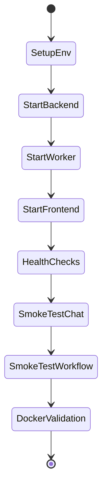

# Developer Guide: Local Testing

This guide explains how to run and verify the full AI Research Agent application locally on Windows.

## What This Covers

- FastAPI backend
- Celery worker processes
- Next.js frontend
- Redis / PostgreSQL / Ollama integration when available
- Health checks and smoke tests

## Local Test Flow



## Prerequisites

- Python 3.11+
- Node.js 18+
- npm
- Optional but recommended: Docker Desktop
- Optional but recommended: Redis, PostgreSQL, and Ollama running locally or via Docker

## 1. Prepare Environment

From the repository root, make sure the root `.env` file exists and is populated from `env.template`.

```powershell
cd C:\Users\himan\Desktop\Research_agent
type .env
```

If you need to activate the virtual environment first:

```powershell
venv\Scripts\Activate.ps1
```

## 2. Start the Backend

If `make` is available:

```powershell
make run-api
```

If `make` is not available on Windows, run the backend directly:

```powershell
python -m uvicorn api.main:app --reload --host 0.0.0.0 --port 8000
```

Expected result:

- API available at `http://localhost:8000`
- OpenAPI docs available at `http://localhost:8000/docs`

## 3. Start the Worker

In a second terminal:

```powershell
make run-worker
```

If `make` is unavailable:

```powershell
celery -A workers.celery_app worker -Q research,browser -l info --concurrency=2
```

## 4. Start the Frontend

In a third terminal:

```powershell
cd C:\Users\himan\Desktop\Research_agent\frontend
npm install
npm run dev
```

Expected result:

- Frontend available at `http://localhost:3000`

## 5. Run Health Checks

Use these requests to verify the backend is healthy:

```powershell
curl http://localhost:8000/health
curl http://localhost:8000/health/live
curl http://localhost:8000/health/ready
```

## 6. Run Backend Tests

From the repository root:

```powershell
python -m pytest -v --tb=short
```

Optional quality checks:

```powershell
ruff check .
mypy .
```

## 7. Run Frontend Tests

From the `frontend` folder:

```powershell
npm run type-check
npm run test
npm run build
```

If you want linting too:

```powershell
npm run lint
```

## 8. Smoke Test the Full Application

After backend and frontend are up:

1. Open `http://localhost:3000`.
2. Submit a research query in the chat UI.
3. Confirm a session is created.
4. Confirm the UI shows streaming or progress updates.
5. Open workflow, queue, models, and observability pages.
6. Confirm each page renders without errors.

## 9. Docker Validation

If you want to test the whole stack together:

```powershell
cd C:\Users\himan\Desktop\Research_agent
make docker-up
```

If `make` is unavailable, use Docker Compose directly:

```powershell
docker compose -f deployment\docker-compose.yml up -d
```

Then verify containers:

```powershell
docker compose -f deployment\docker-compose.yml ps
```

## 10. Acceptance Checklist

Use this checklist to confirm the app is working locally:

- Backend responds on `/health`
- Backend docs load on `/docs`
- Frontend loads on port `3000`
- Chat page submits a request
- WebSocket connection establishes
- Workflow page renders
- Queue page renders
- Models page renders
- Observability page renders
- Worker process stays running
- Docker Compose starts successfully

## Common Issues

### `make` is not recognized

Use the direct commands shown above. On Windows, `uvicorn`, `celery`, and `npm` are often the simplest local path.

### Backend fails to start

- Check `.env`
- Confirm the virtual environment is active
- Ensure required dependencies are installed

### Frontend fails to start

- Run `npm install` in `frontend`
- Confirm Node.js 18+ is installed
- Rebuild with `npm run build`

### Docker does not start

- Ensure Docker Desktop is running
- Confirm ports `3000`, `8000`, `5432`, `6379`, and `11434` are free

## Recommended Local Test Order

1. Start backend
2. Start worker
3. Start frontend
4. Run health checks
5. Submit a chat request
6. Validate workflow and dashboard pages
7. Run automated tests
8. Validate Docker Compose
