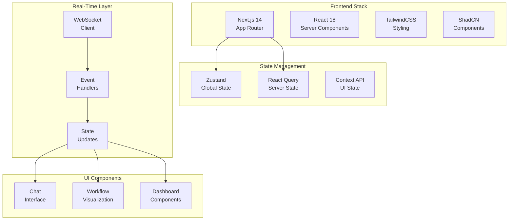
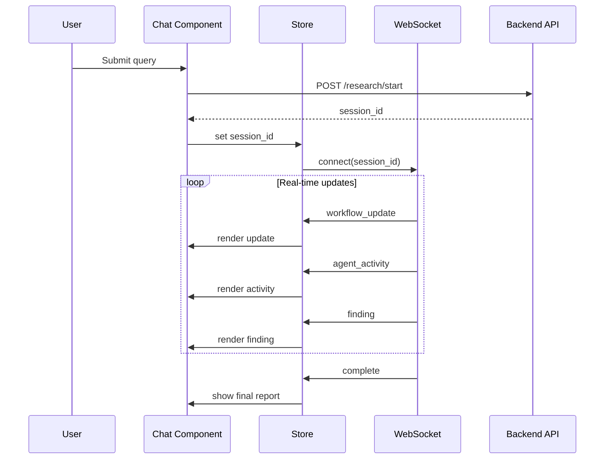

# Frontend Architecture Documentation

## Purpose

This document provides comprehensive documentation of the Next.js frontend architecture. It explains the websocket layer, state management, workflow visualization, and dashboard components. This documentation is essential for understanding how the frontend interfaces with the backend and provides real-time research updates.

---

## 1. Frontend Architecture Overview

The frontend is built on Next.js with a focus on real-time updates and intuitive research visualization:



---

## 2. Project Structure

```
frontend/
├── app/                    # Next.js App Router
│   ├── page.tsx           # Main page
│   ├── layout.tsx         # Root layout
│   └── api/               # API routes
├── components/            # React components
│   ├── ui/               # Base UI components
│   ├── chat/             # Chat components
│   ├── workflow/         # Workflow visualization
│   └── dashboard/        # Dashboard components
├── features/             # Feature modules
├── hooks/                # Custom React hooks
├── lib/                  # Utilities
├── services/             # API services
├── stores/               # Zustand stores
├── types/                # TypeScript types
└── websocket/            # WebSocket client
```

---

## 3. WebSocket Layer

### WebSocket Client

```typescript
class WebSocketClient {
  private ws: WebSocket | null = null;
  private reconnectAttempts = 0;
  private maxReconnectAttempts = 5;

  connect(sessionId: string): void {
    this.ws = new WebSocket(`ws://api/ws/${sessionId}`);

    this.ws.onopen = () => {
      console.log('WebSocket connected');
      this.reconnectAttempts = 0;
    };

    this.ws.onmessage = (event) => {
      const data = JSON.parse(event.data);
      this.handleMessage(data);
    };

    this.ws.onclose = () => {
      this.handleReconnect();
    };
  }

  private handleMessage(data: WebSocketMessage): void {
    switch (data.type) {
      case 'workflow_update':
        // Update workflow state
        break;
      case 'agent_activity':
        // Update agent activity
        break;
      case 'finding':
        // Add new finding
        break;
      case 'error':
        // Handle error
        break;
    }
  }
}
```

### WebSocket Events

| Event | Description | Payload |
|-------|-------------|---------|
| workflow_update | Workflow state change | { status, progress, current_agent } |
| agent_activity | Agent execution event | { agent, action, details } |
| finding | New research finding | { summary, source, type } |
| error | Error occurred | { error, stage } |
| complete | Workflow complete | { final_report } |

---

## 4. State Management

### Zustand Store

```typescript
interface ResearchState {
  sessionId: string | null;
  query: string;
  status: 'idle' | 'planning' | 'researching' | 'writing' | 'complete' | 'error';
  progress: number;
  currentAgent: string | null;
  tasks: Task[];
  findings: Finding[];
  sources: string[];
  finalReport: string | null;
  errors: Error[];
}

interface ResearchStore {
  state: ResearchState;
  setQuery: (query: string) => void;
  startResearch: () => void;
  updateProgress: (progress: number) => void;
  addFinding: (finding: Finding) => void;
  setStatus: (status: ResearchState['status']) => void;
  setError: (error: Error) => void;
  reset: () => void;
}
```

### Store Implementation

```typescript
const useResearchStore = create<ResearchStore>((set) => ({
  state: initialState,

  setQuery: (query) => set((state) => ({
    state: { ...state.state, query }
  })),

  startResearch: () => set((state) => ({
    state: { ...state.state, status: 'planning' }
  })),

  updateProgress: (progress) => set((state) => ({
    state: { ...state.state, progress }
  })),

  addFinding: (finding) => set((state) => ({
    state: {
      ...state.state,
      findings: [...state.state.findings, finding]
    }
  })),

  setStatus: (status) => set((state) => ({
    state: { ...state.state, status }
  })),

  setError: (error) => set((state) => ({
    state: { ...state.state, errors: [...state.state.errors, error] }
  })),

  reset: () => set({ state: initialState })
}));
```

---

## 5. Workflow Visualization

### Workflow Diagram Component

```typescript
interface WorkflowNode {
  id: string;
  label: string;
  status: 'pending' | 'active' | 'completed' | 'failed';
  type: 'agent' | 'task' | 'decision';
}

interface WorkflowEdge {
  source: string;
  target: string;
  label?: string;
}

const WorkflowDiagram: React.FC<{
  nodes: WorkflowNode[];
  edges: WorkflowEdge[];
  currentNode?: string;
}> = ({ nodes, edges, currentNode }) => {
  return (
    <div className="workflow-diagram">
      <ReactFlow
        nodes={nodes.map(n => ({
          ...n,
          style: {
            background: n.id === currentNode ? '#3b82f6' : '#fff',
            border: n.status === 'completed' ? '2px solid #22c55e' : '1px solid #ccc'
          }
        }))}
        edges={edges}
        fitView
      />
    </div>
  );
};
```

### Agent Activity Panel

```typescript
const AgentActivityPanel: React.FC = () => {
  const { state } = useResearchStore();

  return (
    <div className="agent-activity">
      <h3>Agent Activity</h3>
      <div className="activity-list">
        {state.currentAgent && (
          <div className="active-agent">
            <span className="pulse" />
            {state.currentAgent}
          </div>
        )}
        {state.tasks.map((task, i) => (
          <div key={i} className={`task ${task.status}`}>
            {task.description}
          </div>
        ))}
      </div>
    </div>
  );
};
```

---

## 6. Chat Interface

### Chat Component

```typescript
const ChatInterface: React.FC = () => {
  const { state, sendMessage } = useChatStore();
  const [input, setInput] = useState('');

  const handleSubmit = (e: FormEvent) => {
    e.preventDefault();
    if (input.trim()) {
      sendMessage(input);
      setInput('');
    }
  };

  return (
    <div className="chat-interface">
      <div className="messages">
        {state.messages.map((msg, i) => (
          <div key={i} className={`message ${msg.role}`}>
            {msg.content}
          </div>
        ))}
      </div>
      <form onSubmit={handleSubmit}>
        <input
          value={input}
          onChange={(e) => setInput(e.target.value)}
          placeholder="Ask a research question..."
        />
        <button type="submit">Send</button>
      </form>
    </div>
  );
};
```

---

## 7. API Services

### Research API Client

```typescript
class ResearchAPIClient {
  private baseUrl = '/api/v1';

  async startResearch(query: string): Promise<SessionResponse> {
    const response = await fetch(`${this.baseUrl}/research/start`, {
      method: 'POST',
      headers: { 'Content-Type': 'application/json' },
      body: JSON.stringify({ query })
    });
    return response.json();
  }

  async getSessionStatus(sessionId: string): Promise<StatusResponse> {
    const response = await fetch(`${this.baseUrl}/research/${sessionId}/status`);
    return response.json();
  }

  async getFindings(sessionId: string): Promise<FindingsResponse> {
    const response = await fetch(`${this.baseUrl}/research/${sessionId}/findings`);
    return response.json();
  }

  async getReport(sessionId: string): Promise<ReportResponse> {
    const response = await fetch(`${this.baseUrl}/research/${sessionId}/report`);
    return response.json();
  }
}
```

---

## 8. Dashboard Components

### Research Timeline

```typescript
const ResearchTimeline: React.FC = () => {
  const { state } = useResearchStore();

  const timeline = [
    { stage: 'Planning', status: state.status === 'planning' ? 'active' : 'completed' },
    { stage: 'Research', status: state.status === 'researching' ? 'active' : 'completed' },
    { stage: 'Writing', status: state.status === 'writing' ? 'active' : 'completed' },
    { stage: 'Complete', status: state.status === 'complete' ? 'active' : 'pending' }
  ];

  return (
    <div className="timeline">
      {timeline.map((item, i) => (
        <div key={i} className={`timeline-item ${item.status}`}>
          <div className="marker" />
          <span>{item.stage}</span>
        </div>
      ))}
    </div>
  );
};
```

### Source Citations

```typescript
const SourceCitations: React.FC = () => {
  const { state } = useResearchStore();

  return (
    <div className="citations">
      <h3>Sources</h3>
      <ul>
        {state.sources.map((source, i) => (
          <li key={i}>
            <a href={source} target="_blank" rel="noopener noreferrer">
              {source}
            </a>
          </li>
        ))}
      </ul>
    </div>
  );
};
```

---

## 9. Real-Time Updates Flow



---

## Related Documentation

- [System Overview](../architecture/system-overview.md)
- [API Reference](../api/api-reference.md)
- [WebSocket Events](../api/api-reference.md#websocket-events)