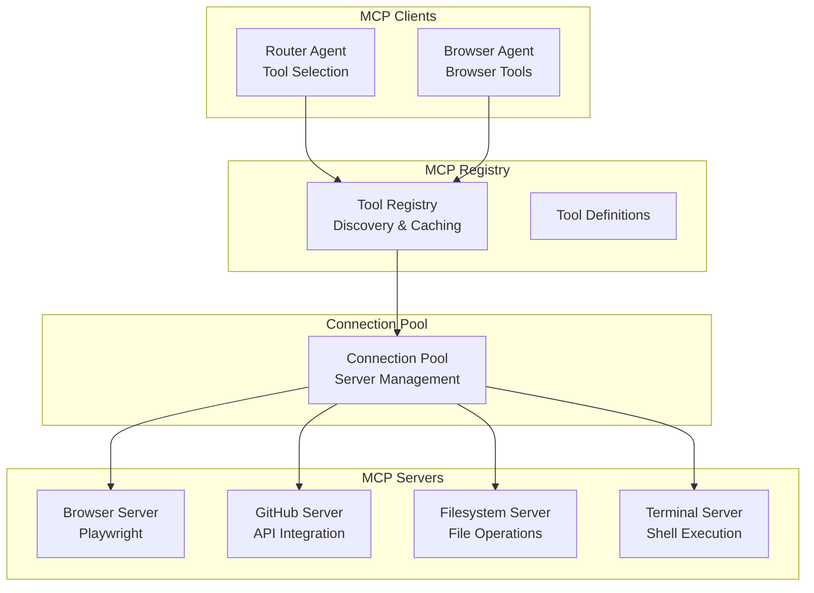
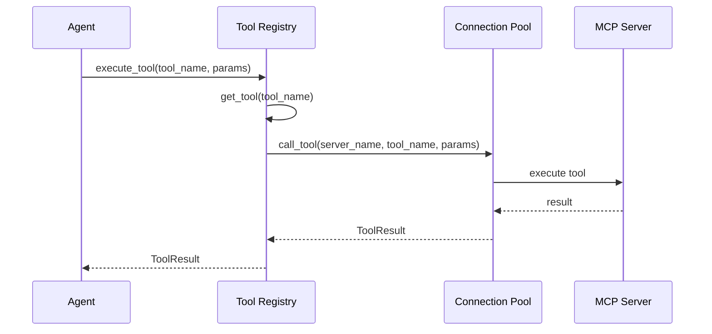
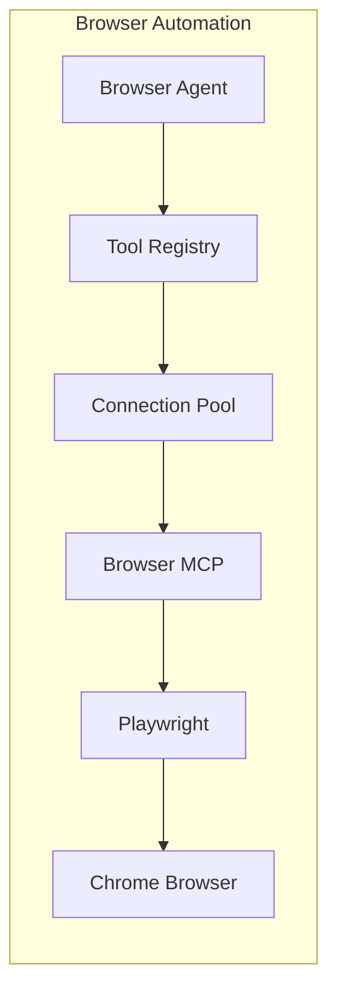
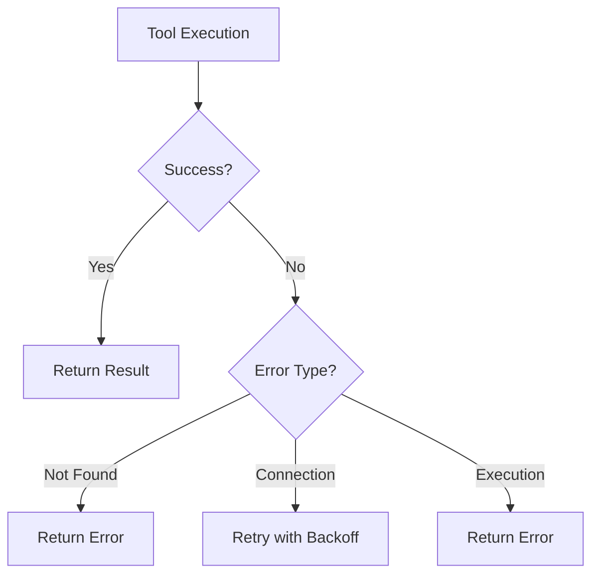

# MCP Architecture Documentation

## Purpose

This document provides comprehensive documentation of the Model Context Protocol (MCP) integration. It explains MCP clients, the tool registry, browser tools, GitHub tools, filesystem tools, and terminal tools. This documentation is essential for understanding how the platform integrates external capabilities through MCP.

---

## 1. MCP Architecture Overview

The platform implements a complete MCP ecosystem for tool integration:



---

## 2. MCP Components

### 2.1 Tool Registry

```python
class ToolRegistry:
    def __init__(self, config: RegistryConfig, pool: ConnectionPool):
        self.config = config
        self._pool = pool
        self._tools: Dict[str, Tool] = {}
        self._categories: Dict[ToolCategory, List[str]] = {}

    async def register_tool(self, tool: Tool, metadata: Dict = None):
        """Register a tool"""
        self._tools[tool.name] = tool

    async def get_tool(self, tool_name: str) -> Optional[Tool]:
        """Get tool by name"""
        return self._tools.get(tool_name)

    async def search_tools(self, query: str) -> List[Tool]:
        """Search tools by name or description"""
        # Search implementation
        pass

    async def execute_tool(
        self,
        tool_name: str,
        parameters: Dict[str, Any],
        server_name: str = None
    ) -> ToolResult:
        """Execute a tool"""
        # Execution implementation
        pass
```

### 2.2 Connection Pool

```python
class ConnectionPool:
    def __init__(self, config: PoolConfig):
        self.config = config
        self._connections: Dict[str, MCPConnection] = {}

    async def register_server(self, config: MCPClientConfig):
        """Register an MCP server"""
        connection = await self._create_connection(config)
        self._connections[config.server_name] = connection

    async def call_tool(
        self,
        server_name: str,
        tool_name: str,
        parameters: Dict
    ) -> ToolResult:
        """Call a tool on a server"""
        connection = self._connections.get(server_name)
        return await connection.call_tool(tool_name, parameters)
```

### 2.3 Transport Types

```python
class TransportType(Enum):
    STDIO = "stdio"
    HTTP = "http"
    WEBSOCKET = "websocket"
```

---

## 3. MCP Servers

### 3.1 Browser Server

**Purpose**: Web automation using Playwright

**Capabilities**:
- Navigate to URLs
- Extract page content
- Take screenshots
- Fill forms
- Execute JavaScript

```python
class BrowserServer:
    async def navigate(self, url: str) -> PageResult:
        """Navigate to URL and return content"""
        async with async_playwright() as p:
            browser = await p.chromium.launch()
            page = await browser.new_page()
            await page.goto(url)
            content = await page.content()
            await browser.close()
            return PageResult(content=content)

    async def screenshot(self, url: str) -> bytes:
        """Take screenshot of page"""
        # Implementation
        pass
```

### 3.2 GitHub Server

**Purpose**: GitHub repository analysis

**Capabilities**:
- Search repositories
- Get file contents
- List directory contents
- Get repository metadata
- Search code

```python
class GitHubServer:
    async def search_repos(self, query: str) -> List[Repo]:
        """Search GitHub repositories"""
        # GitHub API implementation
        pass

    async def get_file(self, repo: str, path: str) -> FileContent:
        """Get file content from repository"""
        # Implementation
        pass

    async def get_readme(self, repo: str) -> str:
        """Get repository README"""
        # Implementation
        pass
```

### 3.3 Filesystem Server

**Purpose**: Local file operations

**Capabilities**:
- Read files
- Write files
- List directories
- Search files
- Get file metadata

```python
class FilesystemServer:
    async def read_file(self, path: str) -> str:
        """Read file content"""
        with open(path, 'r') as f:
            return f.read()

    async def write_file(self, path: str, content: str):
        """Write file content"""
        with open(path, 'w') as f:
            f.write(content)

    async def list_directory(self, path: str) -> List[FileInfo]:
        """List directory contents"""
        # Implementation
        pass
```

### 3.4 Terminal Server

**Purpose**: Shell command execution

**Capabilities**:
- Execute commands
- Get command output
- Manage processes

```python
class TerminalServer:
    async def execute(self, command: str, cwd: str = None) -> CommandResult:
        """Execute shell command"""
        process = await asyncio.create_subprocess_shell(
            command,
            stdout=asyncio.subprocess.PIPE,
            stderr=asyncio.subprocess.PIPE,
            cwd=cwd
        )
        stdout, stderr = await process.communicate()
        return CommandResult(
            stdout=stdout.decode(),
            stderr=stderr.decode(),
            exit_code=process.returncode
        )
```

---

## 4. Tool Schema

### Tool Definition

```python
@dataclass
class Tool:
    id: str
    name: str
    description: str
    category: ToolCategory
    server_name: str
    parameters: List[ToolParameter]
    returns: ToolReturn
```

### Tool Categories

```python
class ToolCategory(Enum):
    BROWSER = "browser"
    GITHUB = "github"
    FILESYSTEM = "filesystem"
    TERMINAL = "terminal"
    SEARCH = "search"
    CUSTOM = "custom"
```

---

## 5. Tool Execution Flow



---

## 6. Browser Automation

### Browser MCP Integration



### Browser Tools

| Tool | Description | Parameters |
|------|-------------|-------------|
| browser_navigate | Navigate to URL | url |
| browser_screenshot | Take screenshot | url, full_page |
| browser_evaluate | Execute JS | url, script |
| browser_click | Click element | url, selector |
| browser_fill | Fill form field | url, selector, value |

---

## 7. Tool Discovery

### Auto-Discovery

```python
class ToolDiscovery:
    async def discover_tools(self, server_name: str) -> List[Tool]:
        """Discover tools from MCP server"""
        # List tools from server
        response = await self._call_server(
            server_name,
            "tools/list"
        )
        return [self._parse_tool(t) for t in response.tools]
```

### Discovery Loop

```python
async def _discovery_loop(self):
    """Periodic tool discovery"""
    while True:
        await asyncio.sleep(self.config.discovery_interval)

        if self._pool:
            all_tools = await self._pool.get_all_tools()
            for tool_name, tool in all_tools.items():
                if tool_name not in self._tools:
                    await self.register_tool(tool)
```

---

## 8. Tool Statistics

```python
async def get_tool_stats(self) -> Dict[str, Any]:
    """Get tool usage statistics"""
    return {
        "total_tools": len(self._tools),
        "by_category": {
            category.value: len(tools)
            for category, tools in self._categories.items()
        },
        "most_used": sorted(
            [(name, meta["use_count"]) for name, meta in self._tool_metadata.items()],
            key=lambda x: x[1],
            reverse=True
        )[:10]
    }
```

---

## 9. Error Handling

### Tool Error Types

```python
class ToolError(Exception):
    """Base tool error"""
    pass

class ToolNotFoundError(ToolError):
    """Tool not found in registry"""
    pass

class ServerConnectionError(ToolError):
    """Cannot connect to MCP server"""
    pass

class ToolExecutionError(ToolError):
    """Tool execution failed"""
    pass
```

### Error Handling Flow



---

## Related Documentation

- [Agent Architecture](../agents/agents.md)
- [System Overview](../architecture/system-overview.md)
- [Distributed Execution](../backend/distributed-execution.md)