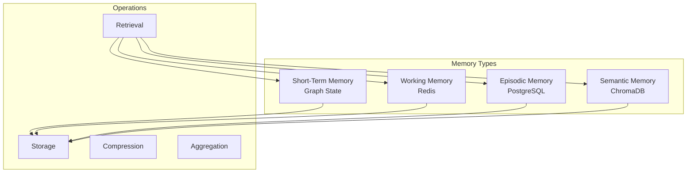
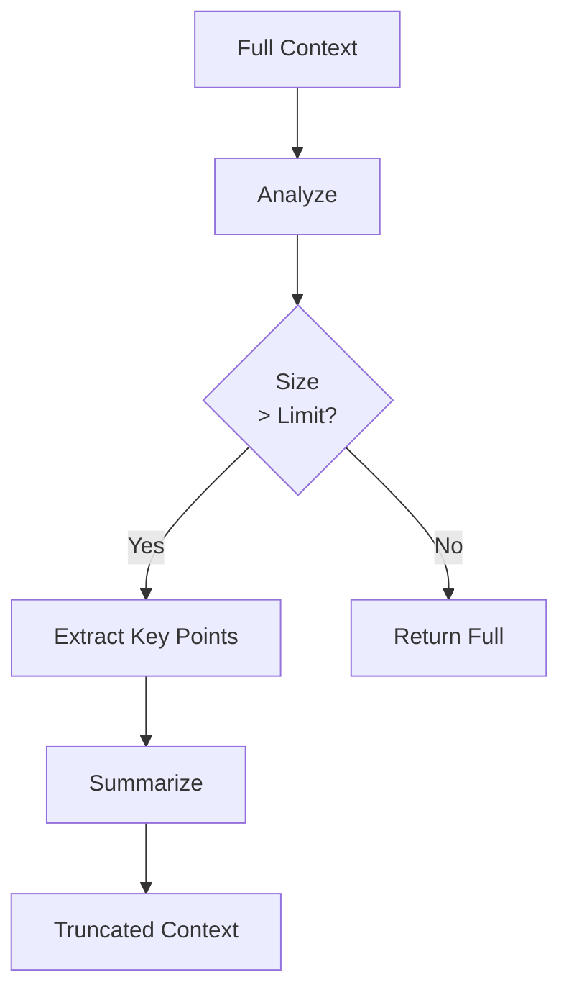
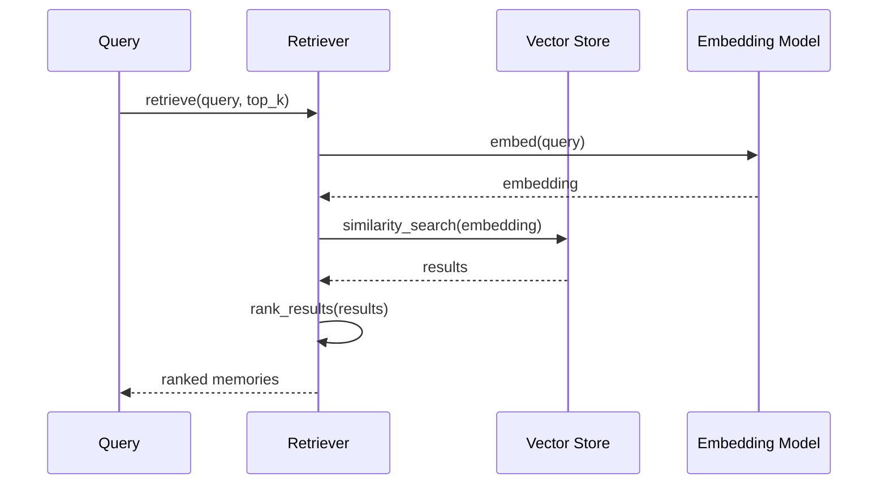
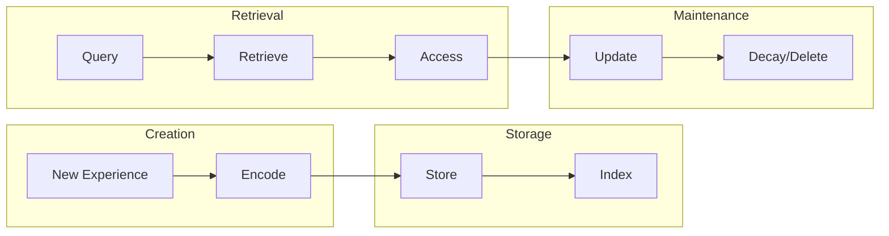

# Memory System Documentation

## Purpose

This document provides comprehensive documentation of the memory architecture. It explains semantic memory, episodic memory, context compression, and the complete memory lifecycle. This documentation is essential for understanding how the platform maintains context across sessions and optimizes token usage.

---

## 1. Memory Architecture Overview

The platform implements a multi-tier memory system:



---

## 2. Memory Types

### 2.1 Short-Term Memory

**Storage**: Graph State (in-memory)

**Purpose**: Temporary reasoning and active workflow context

**Lifetime**: Single workflow execution

**Contents**:
- Current query
- Active tasks
- Partial findings
- Agent state

### 2.2 Working Memory

**Storage**: Redis

**Purpose**: Fast access cache for active sessions

**Lifetime**: Session duration (configurable TTL)

**Contents**:
- Session context
- Queue state
- Task results cache

### 2.3 Episodic Memory

**Storage**: PostgreSQL

**Purpose**: Session history and execution logs

**Lifetime**: Permanent (user-controlled deletion)

**Contents**:
- Completed sessions
- Research reports
- Task history
- User interactions

### 2.4 Semantic Memory

**Storage**: ChromaDB (vector store)

**Purpose**: Embeddings and semantic search

**Lifetime**: Permanent (until deleted)

**Contents**:
- Document embeddings
- Research findings vectors
- Context embeddings

---

## 3. Semantic Memory System

### Vector Store Integration

```python
class SemanticMemory:
    def __init__(self):
        self.vector_store = get_vector_store()
        self.embedding_model = get_embedding_model()

    async def store(self, content: str, metadata: Dict):
        """Store content with embeddings"""
        embedding = await self.embedding_model.embed(content)
        document = VectorDocument(
            id=generate_id(),
            content=content,
            embedding=embedding,
            metadata=metadata
        )
        await self.vector_store.add_documents([document])

    async def retrieve(self, query: str, top_k: int = 5):
        """Retrieve semantically similar content"""
        query_embedding = await self.embedding_model.embed(query)
        results = await self.vector_store.similarity_search(
            query_embedding=query_embedding,
            top_k=top_k
        )
        return results
```

### Memory Collection

```python
class MemoryCollection:
    """Collection of related memories"""

    def __init__(self, session_id: str):
        self.session_id = session_id
        self.memories: List[Memory] = []

    async def add(self, memory: Memory):
        """Add memory to collection"""
        self.memories.append(memory)

    async def search(self, query: str) -> List[Memory]:
        """Search memories"""
        # Semantic search implementation
        pass
```

---

## 4. Context Compression

### Compression Strategy

When context exceeds token limits, the system compresses context:



### Compression Implementation

```python
class ContextCompressor:
    def __init__(self, max_tokens: int = 4000):
        self.max_tokens = max_tokens

    async def compress(self, context: str) -> str:
        """Compress context to fit token limit"""
        tokens = count_tokens(context)

        if tokens <= self.max_tokens:
            return context

        # Extract key sections
        sections = self._extract_sections(context)

        # Summarize each section
        compressed = await self._summarize_sections(sections)

        return compressed
```

---

## 5. Memory Retrieval

### Retrieval Pipeline



### Retrieval Ranking

```python
async def rank_results(self, results: List[SearchResult]) -> List[Memory]:
    """Rank retrieved memories by relevance"""
    ranked = []

    for result in results:
        # Calculate recency score
        recency = self._calculate_recency(result.metadata)

        # Calculate relevance score
        relevance = result.score

        # Combined score
        combined = (relevance * 0.7) + (recency * 0.3)
        ranked.append((combined, result))

    # Sort by combined score
    ranked.sort(key=lambda x: x[0], reverse=True)
    return [r for _, r in ranked]
```

---

## 6. Memory Lifecycle

### Memory Flow



### Memory Operations

| Operation | Description | Trigger |
|------------|-------------|---------|
| Store | Save new memory | Task completion |
| Retrieve | Fetch relevant memories | Query processing |
| Update | Modify existing memory | Context refresh |
| Delete | Remove memory | User request/TTL |

---

## 7. Session Memory Management

### Session Context

```python
class SessionMemory:
    def __init__(self, session_id: str):
        self.session_id = session_id
        self.context: Dict = {}
        self.findings: List[Dict] = []
        self.sources: List[str] = []

    async def add_finding(self, finding: Dict):
        """Add research finding"""
        self.findings.append(finding)

    async def get_context(self) -> Dict:
        """Get current session context"""
        return {
            "session_id": self.session_id,
            "findings_count": len(self.findings),
            "sources": self.sources,
            "context": self.context
        }
```

### Session Persistence

```python
async def persist_session(self, session: SessionMemory):
    """Persist session to database"""
    await db.sessions.insert({
        "session_id": session.session_id,
        "findings": session.findings,
        "sources": session.sources,
        "context": session.context,
        "completed_at": datetime.utcnow()
    })
```

---

## 8. Memory Optimization

### Token Budget Management

```python
class TokenBudgetManager:
    def __init__(self, max_tokens: int = 8000):
        self.max_tokens = max_tokens
        self.used_tokens = 0

    def allocate(self, component: str, tokens: int) -> bool:
        """Allocate tokens to component"""
        if self.used_tokens + tokens <= self.max_tokens:
            self.used_tokens += tokens
            return True
        return False

    def compress(self, component: str):
        """Trigger compression for component"""
        # Compression logic
        pass
```

### Memory Pruning

```python
async def prune_old_memories(self, max_age_days: int = 30):
    """Remove memories older than max_age_days"""
    cutoff = datetime.utcnow() - timedelta(days=max_age_days)

    await db.memories.delete_many({
        "created_at": {"$lt": cutoff},
        "pinned": False
    })
```

---

## 9. Memory API

### Store Memory

```python
POST /api/v1/memory
{
    "content": "Research findings on quantum computing",
    "metadata": {
        "session_id": "session_123",
        "type": "finding"
    }
}
```

### Retrieve Memory

```python
GET /api/v1/memory?query=quantum&top_k=5
```

### Search Memory

```python
POST /api/v1/memory/search
{
    "query": "quantum computing breakthroughs",
    "filters": {
        "session_id": "session_123"
    }
}
```

---

## Related Documentation

- [RAG System](../rag/rag-system.md)
- [System Overview](../architecture/system-overview.md)
- [Observability](../observability/observability.md)