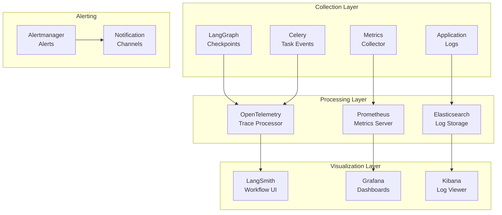

# Observability Documentation

## Purpose

This document provides comprehensive documentation of the observability stack. It explains LangSmith integration, Prometheus metrics, Grafana dashboards, distributed tracing, logging, and alerting. This documentation is essential for operators monitoring system health and debugging issues.

---

## 1. Observability Architecture Overview

The platform implements comprehensive observability across all layers:



---

## 2. LangSmith Integration

### LangGraph Checkpoint Configuration

```python
from langgraph.checkpoint.memory import MemorySaver
from langsmith import traceable

# Create checkpointer with LangSmith integration
checkpointer = MemorySaver()

# Compile graph with checkpointer
compiled = workflow.compile(checkpointer=checkpointer)
```

### Tracing Configuration

```python
from langsmith import Client

langsmith_client = Client(
    api_key=os.getenv("LANGSMITH_API_KEY"),
    project_name="research-agent"
)

# Enable tracing
@traceable
async def execute_agent(agent, state):
    # Agent execution with automatic tracing
    result = await agent.execute(state)
    return result
```

### LangSmith Dashboard

| Metric | Description |
|--------|-------------|
| Total Runs | Number of workflow executions |
| Avg Duration | Average execution time |
| Success Rate | Percentage of successful runs |
| Node Timing | Time spent in each node |
| Error Rate | Failed executions by type |

---

## 3. Prometheus Metrics

### Metrics Collection

```python
from prometheus_client import Counter, Histogram, Gauge

# Request metrics
request_count = Counter(
    'research_requests_total',
    'Total research requests',
    ['status', 'task_type']
)

request_duration = Histogram(
    'research_request_duration_seconds',
    'Request duration',
    ['endpoint']
)

# Queue metrics
queue_depth = Gauge(
    'celery_queue_depth',
    'Number of tasks in queue',
    ['queue']
)

worker_count = Gauge(
    'celery_workers_active',
    'Number of active workers',
    ['worker_type']
)

# Model metrics
model_requests = Counter(
    'model_requests_total',
    'Total model requests',
    ['provider', 'model', 'status']
)

model_latency = Histogram(
    'model_latency_seconds',
    'Model request latency',
    ['provider', 'model']
)

# Token metrics
token_usage = Counter(
    'token_usage_total',
    'Total tokens used',
    ['model', 'type']
)
```

### Prometheus Configuration

```yaml
global:
  scrape_interval: 15s

scrape_configs:
  - job_name: 'research-api'
    static_configs:
      - targets: ['api:8000']

  - job_name: 'celery-workers'
    static_configs:
      - targets: ['celery-exporter:9808']

  - job_name: 'node-exporter'
    static_configs:
      - targets: ['node-exporter:9100']
```

---

## 4. Grafana Dashboards

### Dashboard: Research Overview

```json
{
  "title": "Research Agent Overview",
  "panels": [
    {
      "title": "Active Sessions",
      "type": "stat",
      "targets": [
        {
          "expr": "research_active_sessions"
        }
      ]
    },
    {
      "title": "Requests by Status",
      "type": "piechart",
      "targets": [
        {
          "expr": "rate(research_requests_total[5m])"
        }
      ]
    },
    {
      "title": "Request Duration",
      "type": "graph",
      "targets": [
        {
          "expr": "histogram_quantile(0.95, rate(research_request_duration_seconds_bucket[5m]))"
        }
      ]
    }
  ]
}
```

### Dashboard: Worker Status

```json
{
  "title": "Celery Workers",
  "panels": [
    {
      "title": "Queue Depth",
      "type": "graph",
      "targets": [
        {
          "expr": "celery_queue_depth"
        }
      ]
    },
    {
      "title": "Active Workers",
      "type": "stat",
      "targets": [
        {
          "expr": "celery_workers_active"
        }
      ]
    },
    {
      "title": "Task Success Rate",
      "type": "gauge",
      "targets": [
        {
          "expr": "rate(celery_tasks_success_total[5m]) / rate(celery_tasks_total[5m])"
        }
      ]
    }
  ]
}
```

---

## 5. Distributed Tracing

### OpenTelemetry Configuration

```python
from opentelemetry import trace
from opentelemetry.sdk.trace import TracerProvider
from opentelemetry.sdk.trace.export import BatchSpanProcessor
from opentelemetry.exporter.otlp.proto.grpc.trace_exporter import OTLPSpanExporter

# Configure tracer
provider = TracerProvider()
processor = BatchSpanProcessor(
    OTLPSpanExporter(endpoint="http://jaeger:4317")
)
provider.add_span_processor(processor)
trace.set_tracer_provider(provider)

# Create tracer
tracer = trace.get_tracer(__name__)

# Instrument code
@tracer.start_as_current_span("research_execution")
async def execute_research(query: str):
    with tracer.start_as_current_span("planner") as span:
        span.set_attribute("query", query)
        result = await planner.execute(state)

    with tracer.start_as_current_span("router") as span:
        result = await router.execute(state)

    return result
```

### Trace Visualization

| Span | Duration | Attributes |
|------|----------|------------|
| research_execution | 45.2s | session_id, query |
| planner | 1.2s | model, tokens |
| router | 0.8s | tasks_count |
| dispatcher | 0.5s | tasks_dispatched |
| aggregator | 12.3s | tasks_completed |
| reflection | 2.1s | reflection_count |
| writer | 3.4s | word_count |

---

## 6. Logging

### Structured Logging

```python
import logging
import json
from datetime import datetime

class JSONFormatter(logging.Formatter):
    def format(self, record):
        log_data = {
            "timestamp": datetime.utcnow().isoformat(),
            "level": record.levelname,
            "logger": record.name,
            "message": record.getMessage(),
            "session_id": getattr(record, "session_id", None),
            "workflow_id": getattr(record, "workflow_id", None),
        }

        if record.exc_info:
            log_data["exception"] = self.formatException(record.exc_info)

        return json.dumps(log_data)

# Configure logging
handler = logging.StreamHandler()
handler.setFormatter(JSONFormatter())
logger = logging.getLogger("research_agent")
logger.addHandler(handler)
```

### Log Levels

| Level | Usage |
|-------|-------|
| DEBUG | Detailed debugging info |
| INFO | General operational info |
| WARNING | Warning messages |
| ERROR | Error messages |
| CRITICAL | Critical failures |

---

## 7. Alerting Rules

### Prometheus Alert Rules

```yaml
groups:
- name: research_agent_alerts
  rules:
  - alert: HighErrorRate
    expr: rate(http_requests_total{status=~"5.."}[5m]) > 0.05
    for: 5m
    labels:
      severity: critical
    annotations:
      summary: High error rate detected

  - alert: QueueBacklog
    expr: celery_queue_depth > 100
    for: 10m
    labels:
      severity: warning
    annotations:
      summary: Queue backlog growing

  - alert: WorkerDown
    expr: celery_workers_active == 0
    for: 2m
    labels:
      severity: critical
    annotations:
      summary: All workers down

  - alert: HighLatency
    expr: histogram_quantile(0.95, rate(request_duration_seconds_bucket[5m])) > 30
    for: 5m
    labels:
      severity: warning
    annotations:
      summary: High request latency

  - alert: ModelFallback
    expr: rate(model_requests_total{status="fallback"}[5m]) > 0.1
    for: 5m
    labels:
      severity: warning
    annotations:
      summary: High model fallback rate
```

---

## 8. Health Checks

### Health Check Endpoint

```python
@app.get("/api/v1/health")
async def health_check():
    components = {}

    # Check Redis
    try:
        await redis.ping()
        components["redis"] = "healthy"
    except:
        components["redis"] = "unhealthy"

    # Check Celery
    try:
        inspect = Inspect(celery_app)
        stats = inspect.stats()
        components["celery"] = "healthy" if stats else "no_workers"
    except:
        components["celery"] = "unhealthy"

    # Check Ollama
    try:
        models = ollama.list()
        components["ollama"] = "healthy"
    except:
        components["ollama"] = "unhealthy"

    status = "healthy" if all(v == "healthy" for v in components.values()) else "degraded"

    return {
        "status": status,
        "components": components,
        "timestamp": datetime.utcnow().isoformat()
    }
```

---

## Related Documentation

- [System Overview](../architecture/system-overview.md)
- [Kubernetes Deployment](../deployment/kubernetes.md)
- [Scaling Strategy](../scaling/scaling-strategy.md)