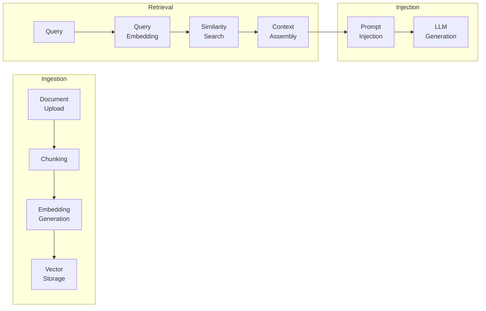
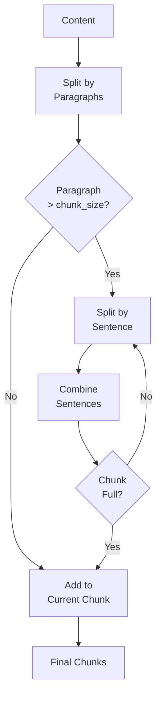
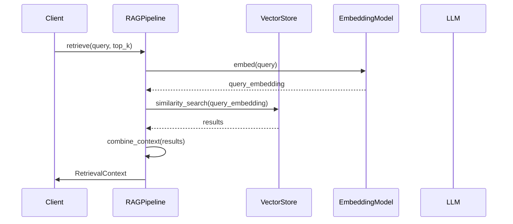
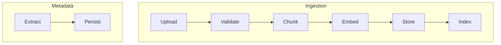

# RAG System Documentation

## Purpose

This document provides comprehensive documentation of the Retrieval-Augmented Generation (RAG) system. It explains embeddings, retrieval mechanisms, vector stores, chunking strategies, and the complete RAG pipeline. This documentation is essential for understanding how the platform processes documents and retrieves relevant context.

---

## 1. RAG Pipeline Overview

The RAG pipeline implements the complete document processing and retrieval workflow:



---

## 2. Document Processing

### Supported Document Types

| Type | Extension | Processing |
|------|-----------|------------|
| PDF | .pdf | PyPDF2/pdfplumber |
| Markdown | .md | Text parsing |
| Text | .txt | Text parsing |
| HTML | .html, .htm | BeautifulSoup |

### Document Processor

```python
class DocumentProcessor:
    def __init__(self):
        self.supported_types = {".pdf", ".md", ".txt", ".html", ".htm"}

    async def process(
        self,
        content: str,
        metadata: DocumentMetadata,
        strategy: ChunkingStrategy = ChunkingStrategy.RECURSIVE,
        chunk_size: int = 1000,
        chunk_overlap: int = 200
    ) -> ProcessedDocument:
        # Clean content
        content = self._clean_content(content)

        # Chunk based on strategy
        if strategy == ChunkingStrategy.RECURSIVE:
            chunks = self._recursive_chunk(content, chunk_size, chunk_overlap)
        elif strategy == ChunkingStrategy.SEMANTIC:
            chunks = self._semantic_chunk(content, chunk_size)
        elif strategy == ChunkingStrategy.FIXED:
            chunks = self._fixed_chunk(content, chunk_size, chunk_overlap)
        else:
            chunks = [content]

        return ProcessedDocument(metadata=metadata, chunks=chunks)
```

---

## 3. Chunking Strategies

### 3.1 Recursive Chunking



**Parameters**:
- chunk_size: 1000 words (default)
- chunk_overlap: 200 words (default)

### 3.2 Semantic Chunking

Split by sentence boundaries while respecting chunk size limits.

### 3.3 Fixed-Size Chunking

Simple word-based chunking with overlap.

### Strategy Comparison

| Strategy | Use Case | Pros | Cons |
|----------|----------|------|------|
| Recursive | General purpose | Preserves context | Complex |
| Semantic | Coherent content | Natural boundaries | Slower |
| Fixed | Simple documents | Fast | May break sentences |

---

## 4. Embedding Generation

### Embedding Model

```python
class EmbeddingModel:
    def __init__(self, model_name: str = "nomic-embed-text"):
        self.model_name = model_name
        self.ollama = OllamaClient()

    async def embed(self, text: str) -> List[float]:
        """Generate embedding for text"""
        response = await self.ollama.embeddings(prompt=text)
        return response.embedding
```

### Batch Embedding

```python
async def generate_embeddings(texts: List[str], batch_size: int = 32):
    """Generate embeddings for batch of texts"""
    results = []
    for i in range(0, len(texts), batch_size):
        batch = texts[i:i + batch_size]
        embeddings = await asyncio.gather(*[
            model.embed(text) for text in batch
        ])
        results.extend(embeddings)
    return results
```

---

## 5. Vector Storage

### Vector Store Provider

```python
class VectorStoreProvider:
    async def initialize(self): ...
    async def create_collection(self, name, metadata): ...
    async def add_documents(self, documents, collection_name): ...
    async def similarity_search(
        self,
        query_embedding,
        collection_name,
        top_k,
        filter_metadata
    ): ...
    async def delete(self, ids, collection_name): ...
```

### Document Structure

```python
@dataclass
class VectorDocument:
    id: str
    content: str
    embedding: List[float]
    metadata: Dict[str, Any]
```

### Search Result

```python
@dataclass
class SearchResult:
    id: str
    content: str
    score: float
    metadata: Dict[str, Any]
```

---

## 6. Retrieval Pipeline

### Full RAG Pipeline



### Retrieval Context

```python
@dataclass
class RetrievalContext:
    query: str
    results: List[SearchResult]
    combined_context: str
    sources: List[str]
    relevance_scores: List[float]
```

---

## 7. Hybrid Retrieval

Combines semantic and keyword search:

```python
async def hybrid_retrieve(
    self,
    query: str,
    keyword_filter: Optional[str] = None,
    top_k: int = 5
) -> RetrievalContext:
    # Get semantic results
    semantic_context = await self.retrieve(query=query, top_k=top_k)

    # If keyword filter provided, filter results
    if keyword_filter:
        filtered_results = [
            r for r in semantic_context.results
            if keyword_filter.lower() in r.content.lower()
        ]
        semantic_context.results = filtered_results

    return semantic_context
```

---

## 8. Context Injection

### Prompt Injection Pattern

```python
async def inject_context(
    self,
    prompt: str,
    query: Optional[str] = None,
    context_query: Optional[str] = None
) -> str:
    search_query = context_query or query or prompt[:200]
    context = await self.get_context(search_query)

    return f"""**Retrieved Context:**

{context}

---

**Original Query:**

{prompt}"""
```

### Context Truncation

```python
def get_context(
    self,
    query: str,
    max_context_length: int = 4000,
    include_citations: bool = True
) -> str:
    context = await self.pipeline.retrieve(query=query, top_k=5)
    context_text = context.combined_context

    # Truncate if too long
    if len(context_text) > max_context_length:
        context_text = context_text[:max_context_length] + "\n\n[truncated]..."

    # Add citations if requested
    if include_citations and context.sources:
        citations = "\n\n**Sources:**\n" + "\n".join([
            f"- {s}" for s in context.sources[:5]
        ])
        context_text += citations

    return context_text
```

---

## 9. Document Metadata

### Metadata Structure

```python
@dataclass
class DocumentMetadata:
    document_id: str
    file_name: str
    file_type: str
    file_size: int
    chunk_count: int
    uploaded_at: datetime
    source_url: Optional[str] = None
    title: Optional[str] = None
    author: Optional[str] = None
    tags: List[str] = None
    session_id: Optional[str] = None
    user_id: Optional[str] = None
```

### Metadata Extraction

```python
def extract_metadata(self, content: str, source: Optional[str] = None):
    metadata = {}

    # Extract title from first heading
    lines = content.split("\n")
    for line in lines[:10]:
        if line.startswith("# "):
            metadata["title"] = line[2:].strip()
            break

    # Extract dates, emails, URLs
    # Extract key terms

    return metadata
```

---

## 10. Ingestion Flow



### Ingestion Result

```python
{
    "document_id": "doc_123",
    "chunk_count": 15,
    "status": "completed",
    "metadata": {
        "file_name": "research.pdf",
        "file_type": ".pdf",
        "title": "Quantum Computing Advances"
    }
}
```

---

## Related Documentation

- [Memory System](../memory/memory-system.md)
- [Model Routing](../backend/model-routing.md)
- [System Overview](../architecture/system-overview.md)