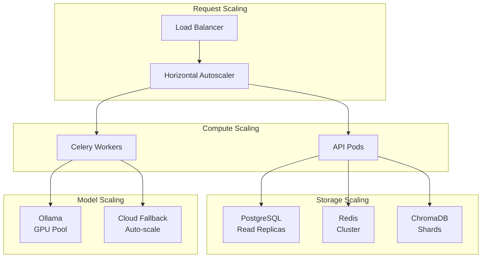
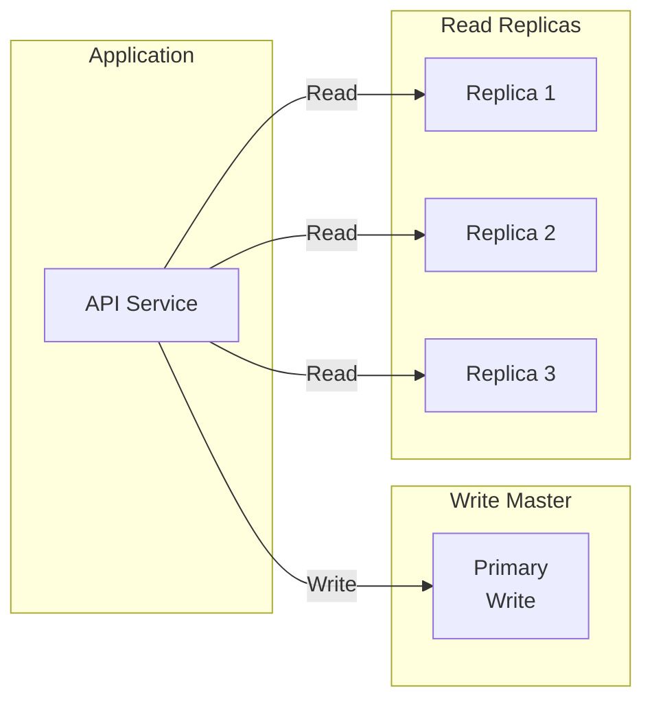

# Scaling Strategy Documentation

## Purpose

This document provides comprehensive documentation of the horizontal and vertical scaling strategies. It explains worker scaling, vector store scaling, model scaling, and Kubernetes autoscaling configuration. This documentation is essential for capacity planning and performance optimization.

---

## 1. Scaling Architecture Overview

The platform implements multi-layer scaling:



---

## 2. API Scaling

### Horizontal Pod Autoscaling

```yaml
apiVersion: autoscaling/v2
kind: HorizontalPodAutoscaler
metadata:
  name: api-hpa
  namespace: research-agent
spec:
  scaleTargetRef:
    apiVersion: apps/v1
    kind: Deployment
    name: research-api
  minReplicas: 3
  maxReplicas: 50
  metrics:
  - type: Resource
    resource:
      name: cpu
      target:
        type: Utilization
        averageUtilization: 70
  - type: Resource
    resource:
      name: memory
      target:
        type: Utilization
        averageUtilization: 80
  - type: Pods
    pods:
      metric:
        name: http_requests_per_second
      target:
        type: AverageValue
        averageValue: "100"
  behavior:
    scaleUp:
      stabilizationWindowSeconds: 60
      policies:
      - type: Percent
        value: 100
        periodSeconds: 60
      - type: Pods
        value: 10
        periodSeconds: 60
      selectPolicy: Max
    scaleDown:
      stabilizationWindowSeconds: 300
```

### Scaling Metrics

| Metric | Threshold | Action |
|--------|-----------|--------|
| CPU Utilization | > 70% | Scale up |
| Memory Utilization | > 80% | Scale up |
| Request Latency | > 500ms | Scale up |
| Error Rate | > 5% | Alert + scale |
| Queue Depth | > 100 | Scale workers |

---

## 3. Worker Scaling

### Celery Worker Autoscaling

```yaml
apiVersion: autoscaling/v2
kind: HorizontalPodAutoscaler
metadata:
  name: celery-research-hpa
  namespace: research-agent
spec:
  scaleTargetRef:
    apiVersion: apps/v1
    kind: Deployment
    name: celery-research-worker
  minReplicas: 2
  maxReplicas: 20
  metrics:
  - type: External
    external:
      metric:
        name: celery_queue_depth
        selector:
          matchLabels:
            queue: research
      target:
        type: AverageValue
        averageValue: "10"
  behavior:
    scaleUp:
      stabilizationWindowSeconds: 30
    scaleDown:
      stabilizationWindowSeconds: 300
```

### Worker Type Scaling

| Worker Type | Min Replicas | Max Replicas | Scale Trigger |
|-------------|---------------|---------------|---------------|
| Research | 2 | 20 | Queue depth > 10 |
| Browser | 1 | 10 | Queue depth > 5 |
| RAG | 2 | 15 | Queue depth > 20 |
| Reflection | 1 | 5 | Queue depth > 10 |

---

## 4. Database Scaling

### PostgreSQL Read Replicas



### PostgreSQL Configuration

```yaml
apiVersion: v1
kind: Service
metadata:
  name: postgres-read
  namespace: research-agent
spec:
  selector:
    app: postgres
    role: replica
  ports:
  - port: 5432
---
apiVersion: v1
kind: Service
metadata:
  name: postgres-write
  namespace: research-agent
spec:
  selector:
    app: postgres
    role: primary
  ports:
  - port: 5432
```

### Redis Cluster

```yaml
apiVersion: v1
kind: ConfigMap
metadata:
  name: redis-config
data:
  redis.conf: |
    cluster-enabled yes
    cluster-config-file nodes.conf
    cluster-node-timeout 5000
    cluster-replica-no-failover yes
```

---

## 5. Vector Store Scaling

### ChromaDB Sharding

```python
class VectorStoreSharding:
    def __init__(self, num_shards: int = 4):
        self.num_shards = num_shards
        self.shards = []

    async def initialize(self):
        """Initialize sharded vector store"""
        for i in range(self.num_shards):
            shard = ChromaClient(
                persist_directory=f"/data/chroma_shard_{i}"
            )
            self.shards.append(shard)

    def _get_shard(self, document_id: str) -> int:
        """Determine shard for document"""
        return hash(document_id) % self.num_shards

    async def add_documents(self, documents: List[VectorDocument]):
        """Add documents to appropriate shards"""
        shard_docs = defaultdict(list)

        for doc in documents:
            shard_idx = self._get_shard(doc.id)
            shard_docs[shard_idx].append(doc)

        for shard_idx, docs in shard_docs.items():
            await self.shards[shard_idx].add(docs)
```

### Qdrant Migration (Production)

```python
# Migration from ChromaDB to Qdrant for production
class QdrantMigration:
    async def migrate(self, chroma_client, qdrant_client):
        """Migrate from ChromaDB to Qdrant"""
        # Export from ChromaDB
        collections = await chroma_client.list_collections()

        for collection in collections:
            # Export data
            data = await chroma_client.get_collection(collection.name)

            # Import to Qdrant
            await qdrant_client.recreate_collection(
                name=collection.name,
                vectors_config=VectorParams(size=768, distance=Distance.COSINE)
            )

            # Batch insert
            await qdrant_client.insert(
                collection_name=collection.name,
                points=data
            )
```

---

## 6. Model Scaling

### Ollama GPU Scaling

```yaml
apiVersion: v1
kind: ConfigMap
metadata:
  name: ollama-config
data:
  config.yaml: |
    gpu:
      enabled: true
      devices: all
    scaling:
      max_models: 4
      model_cache_ttl: 3600
```

### Cloud Fallback Auto-scaling

```python
class CloudFallbackScaler:
    def __init__(self):
        self.fallback_enabled = True
        self.max_concurrent = 100

    async def scale_fallback(self, demand: int):
        """Scale cloud fallback based on demand"""
        if demand > self.max_concurrent:
            # Enable rate limiting
            await self.enable_rate_limiting(
                requests_per_minute=demand // 60
            )
        else:
            await self.disable_rate_limiting()
```

---

## 7. Capacity Planning

### Resource Requirements

| Component | Small | Medium | Large |
|-----------|-------|--------|-------|
| API Pods | 3 x 1CPU, 1GB | 10 x 2CPU, 4GB | 30 x 4CPU, 8GB |
| Workers | 5 x 2CPU, 4GB | 20 x 4CPU, 8GB | 50 x 8CPU, 16GB |
| PostgreSQL | 1 x 2CPU, 4GB | 1 x 4CPU, 16GB | 1 x 8CPU, 32GB + 3 replicas |
| Redis | 3 x 1CPU, 2GB | 3 x 2CPU, 4GB | 6 x 4CPU, 8GB |
| ChromaDB | 1 x 2CPU, 4GB | 4 x 4CPU, 8GB | 8 x 8CPU, 16GB |

### Scaling Guidelines

1. **Start with baseline**: Deploy minimum viable configuration
2. **Monitor metrics**: Track CPU, memory, latency, queue depth
3. **Scale incrementally**: Add capacity in small increments
4. **Test at scale**: Load test before production
5. **Plan for peak**: Design for 2x expected load

---

## 8. Cost Optimization

### Cost-Aware Scaling

```python
class CostOptimizer:
    def __init__(self):
        self.costs = {
            "ollama": 0.0,  # Local (electricity only)
            "openai": 0.003,  # Per 1K tokens
            "anthropic": 0.004,  # Per 1K tokens
            "google": 0.001,  # Per 1K tokens
        }

    def select_model(self, task_type: TaskType, budget: float) -> str:
        """Select most cost-effective model"""
        policy = router.get_policy(task_type)

        if policy.max_cost <= budget:
            return f"{policy.primary_provider}:{policy.primary_model}"

        # Find within budget
        for fallback in policy.fallback_chain:
            if self.costs.get(fallback.split(":")[0], 999) <= budget:
                return fallback

        return policy.primary_model
```

### Cost Monitoring

```python
async def track_cost(provider: str, tokens: int):
    """Track cost per provider"""
    cost = (tokens / 1000) * self.costs.get(provider, 0)

    await metrics.increment(
        "cost_total",
        tags={"provider": provider},
        value=cost
    )
```

---

## Related Documentation

- [System Overview](../architecture/system-overview.md)
- [Kubernetes Deployment](../deployment/kubernetes.md)
- [Observability](../observability/observability.md)