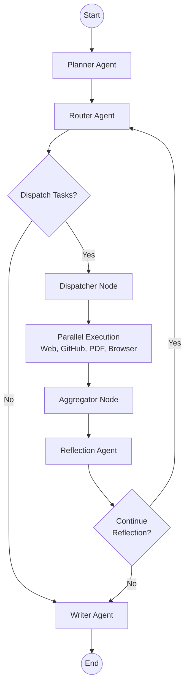
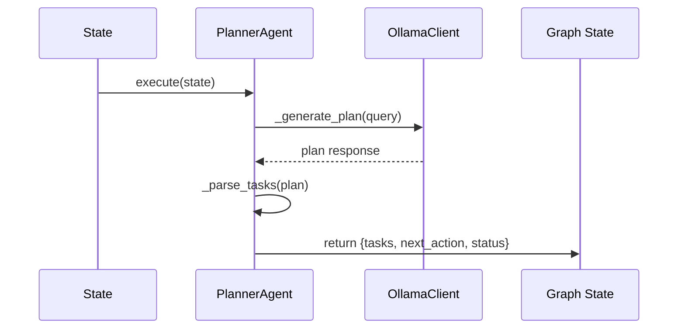
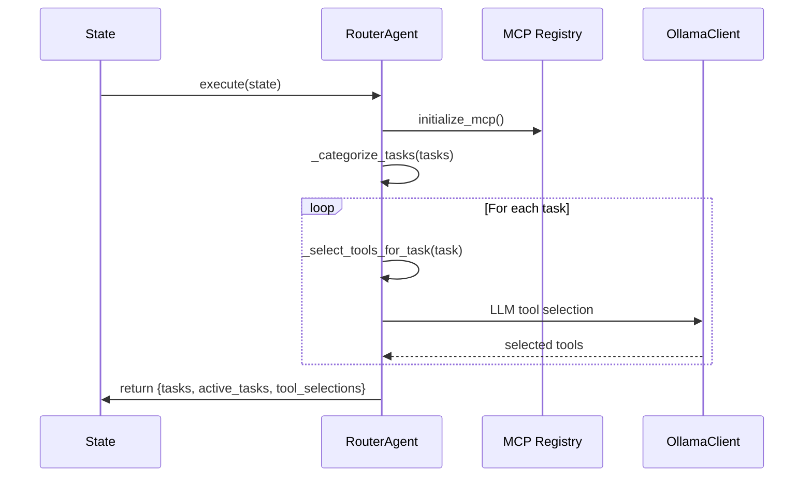
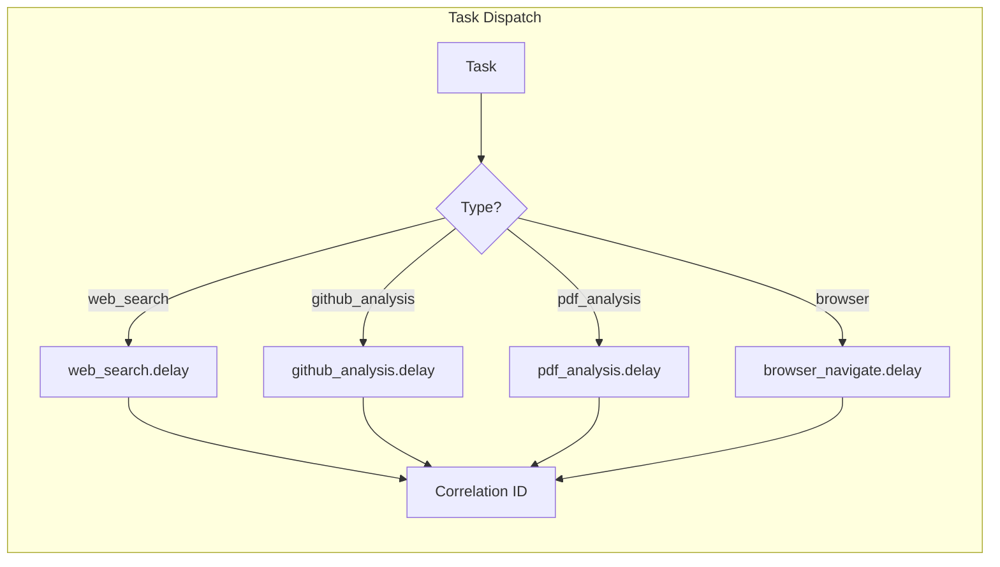
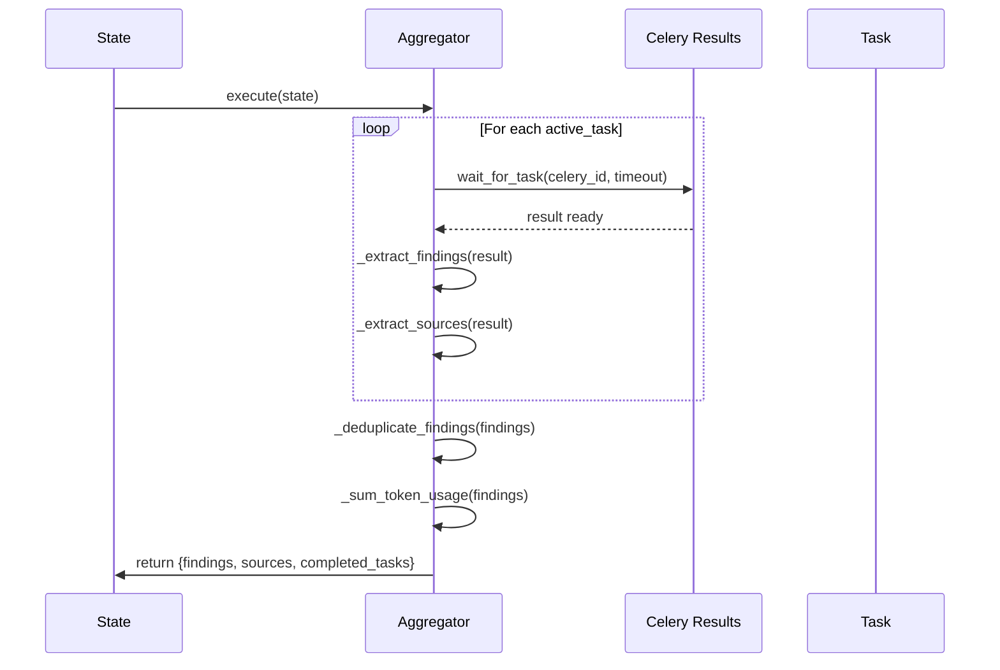
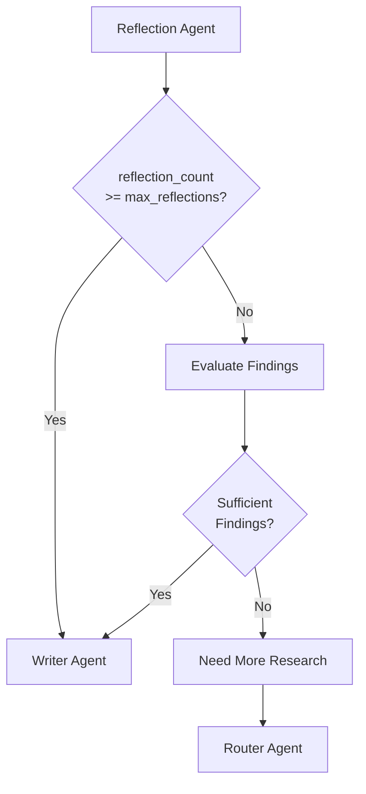
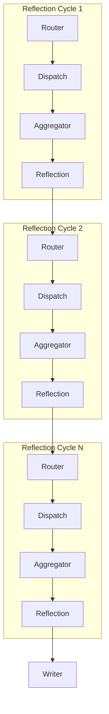
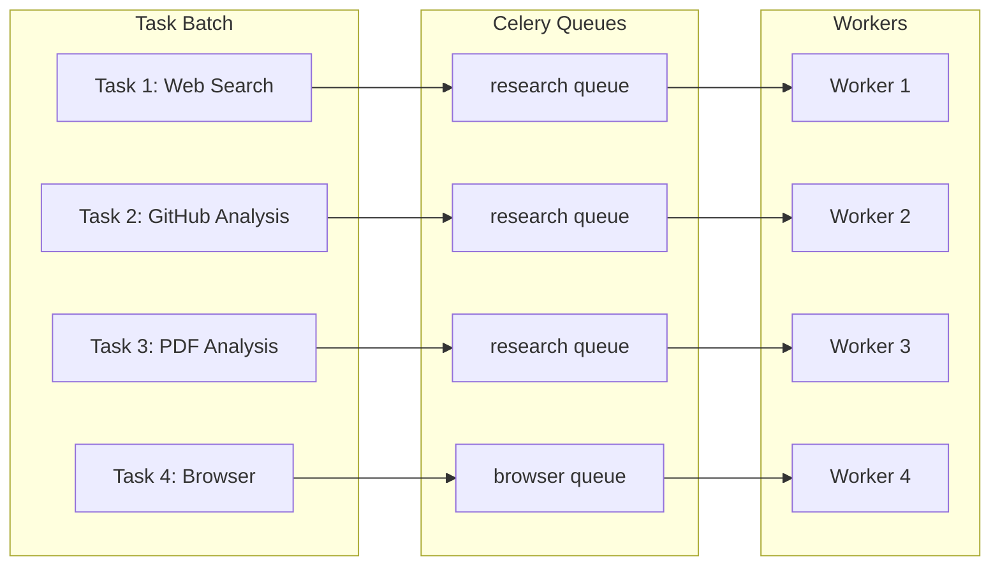
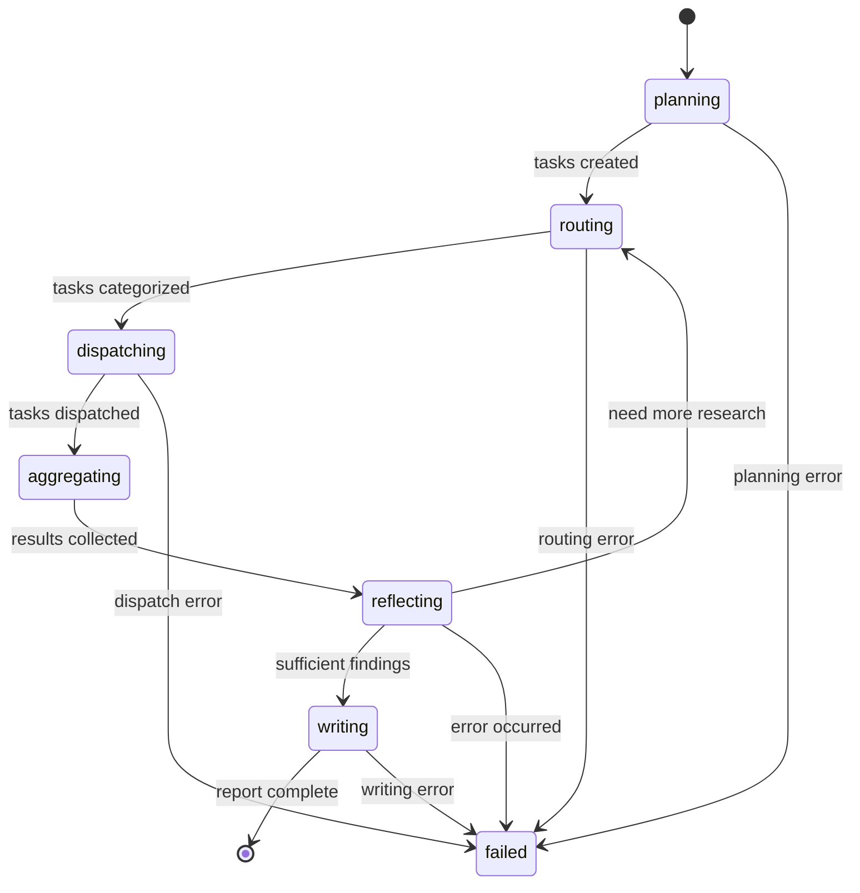

# LangGraph Workflows

## Purpose

This document provides detailed documentation of the LangGraph-based workflow orchestration system. It explains graph nodes, routing logic, reflection loops, aggregation mechanisms, and distributed execution patterns. This documentation is essential for understanding how the platform orchestrates complex multi-agent research workflows.

---

## 1. Workflow Architecture Overview

The LangGraph orchestrator manages the complete research workflow from query input to final report generation:



### Workflow Nodes

| Node | Agent/Component | Purpose |
|------|-----------------|---------|
| Planner | PlannerAgent | Decompose query into tasks |
| Router | RouterAgent | Categorize tasks, select tools |
| Dispatcher | DistributedResearchGraph | Dispatch tasks to Celery |
| Aggregator | DistributedResearchGraph | Collect and merge results |
| Reflection | ReflectionAgent | Evaluate findings, trigger research |
| Writer | WriterAgent | Generate final report |

---

## 2. Graph State Schema

The workflow maintains a comprehensive state object throughout execution:

```python
class ResearchState(TypedDict):
    # Session identification
    session_id: str
    workflow_id: str

    # Query and tasks
    query: str
    tasks: List[dict]
    active_tasks: List[str]
    completed_tasks: List[str]
    failed_tasks: List[dict]

    # Research findings
    findings: List[dict]
    sources: List[str]

    # Memory context
    memory_context: Dict

    # Reflection state
    reflections: List[str]
    reflection_count: int
    max_reflections: int

    # Report generation
    draft_report: str
    final_report: str

    # Execution tracking
    current_agent: str
    next_action: str
    status: str
    progress: float

    # Error handling
    error_state: Optional[dict]

    # Human-in-the-loop
    requires_human_input: bool

    # Observability
    token_usage: Dict[str, int]
    metadata: Dict
```

---

## 3. Node Execution Details

### 3.1 Planner Node



**Responsibilities**:
- Receive user query from state
- Generate research plan using Ollama (qwen3 model)
- Parse plan into structured tasks with types
- Return updated state with task list

**Output**:
```python
{
    "tasks": [
        {"id": "task_1", "description": "...", "type": "web_search", "status": "pending"},
        {"id": "task_2", "description": "...", "type": "github_analysis", "status": "pending"}
    ],
    "next_action": "router",
    "status": "planned",
    "progress": 0.1
}
```

### 3.2 Router Node



**Responsibilities**:
- Initialize MCP connection pool and registry
- Categorize tasks by type (web_search, github_analysis, pdf_analysis, browser)
- Autonomously select appropriate tools using LLM reasoning
- Add execution metadata (queue, timeout, agent)

### 3.3 Dispatcher Node



**Responsibilities**:
- Iterate through all tasks in state
- Map task types to Celery task functions
- Extract parameters based on task type
- Add correlation IDs for tracking
- Dispatch to appropriate Redis queue
- Track pending tasks in internal state

### 3.4 Aggregator Node



**Responsibilities**:
- Poll Celery results for all dispatched tasks
- Extract findings and sources from task results
- Deduplicate findings by content and source
- Sum token usage across all tasks
- Handle partial failures gracefully
- Return aggregated results

**Timeout Handling**:
- Default aggregation timeout: 120 seconds
- Tasks exceeding timeout are marked as failed
- Failed tasks are added to failed_tasks list

### 3.5 Reflection Node



**Responsibilities**:
- Analyze current findings for quality and completeness
- Detect potential hallucinations or inconsistencies
- Validate source credibility
- Determine if additional research is needed
- Enforce max_reflections limit (safety guardrail)

**Safety Guardrail**:
```python
def _should_continue_reflection(state):
    reflection_count = state.get("reflection_count", 0)
    max_reflections = state.get("max_reflections", 3)
    findings = state.get("findings", [])

    # Hard stop on max reflections
    if reflection_count >= max_reflections:
        return "writer"

    # Check for sufficient findings
    if len(findings) >= 5:
        return "writer"

    # Check for error state
    if state.get("error_state"):
        return "writer"

    # Continue research loop
    return "router"
```

### 3.6 Writer Node

**Responsibilities**:
- Aggregate all findings and sources
- Generate structured report with proper formatting
- Add citations and references
- Return final report in state

---

## 4. Conditional Routing

The graph uses conditional edges to determine execution flow:

### 4.1 Router → Dispatcher/Writer

```python
def _should_execute_tasks(state):
    tasks = state.get("tasks", [])
    if tasks and len(tasks) > 0:
        return "dispatch"
    return "writer"
```

### 4.2 Reflection → Router/Writer

```python
def _should_continue_reflection(state):
    # See reflection node section above
```

---

## 5. Reflection Loop

The reflection loop enables iterative research refinement:



### Reflection Loop Behavior

1. **First Cycle**: Initial research based on planner tasks
2. **Subsequent Cycles**: Reflection agent evaluates findings, may trigger additional research
3. **Termination**: When max_reflections reached OR sufficient findings collected

### Reflection Count Enforcement

- Default max_reflections: 3
- Hard stop at limit to prevent infinite loops
- Each cycle increments reflection_count
- Metadata tracks reflection_stopped reason

---

## 6. Parallel Execution

The dispatcher sends tasks to Celery workers for parallel execution:



### Parallel Execution Rules

- Tasks are dispatched immediately after routing
- No waiting for task completion before proceeding
- Aggregator waits for all tasks with timeout
- Partial failure is tolerated (completed tasks still used)

---

## 7. State Transitions



---

## 8. Streaming Events

The graph supports streaming events for real-time UI updates:

```python
async def stream_events(self) -> AsyncGenerator[str, None]:
    async for event in self.graph.astream(
        self.initial_state,
        config={"configurable": {"thread_id": self.session_id}},
    ):
        yield str(event)
```

### Event Types

- Node execution start
- Node execution complete
- State updates
- Error events
- Progress updates

---

## 9. Checkpointing

The graph uses MemorySaver for state persistence:

```python
checkpointer = MemorySaver()
compiled = workflow.compile(checkpointer=checkpointer)
```

**Benefits**:
- Resume interrupted workflows
- Debug state at any point
- Support long-running research tasks

---

## Related Documentation

- [System Overview](../architecture/system-overview.md)
- [Agent Architecture](../agents/agents.md)
- [Distributed Execution](../backend/distributed-execution.md)